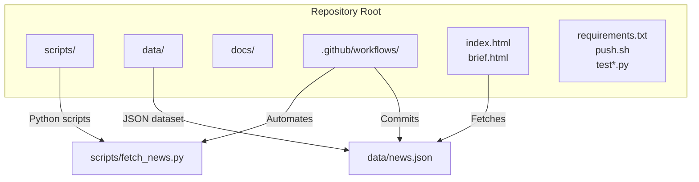
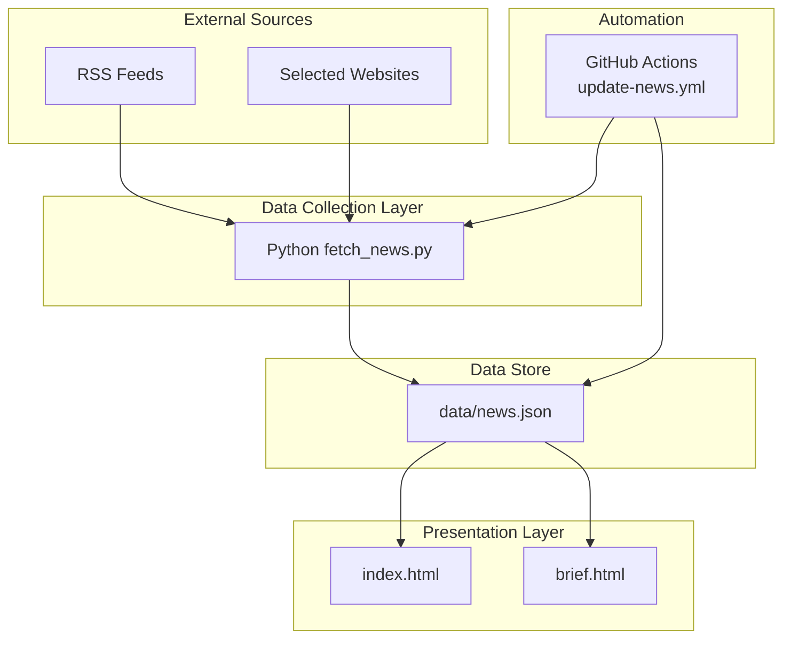
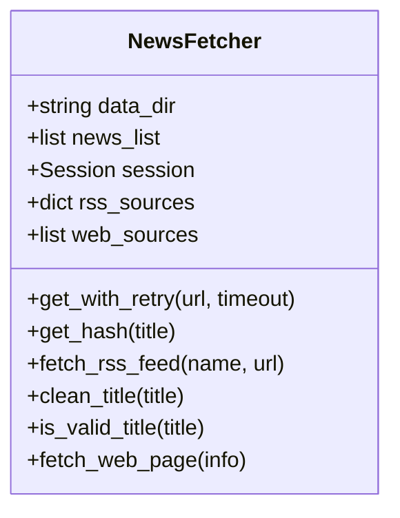
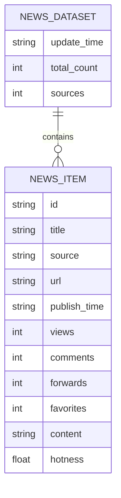
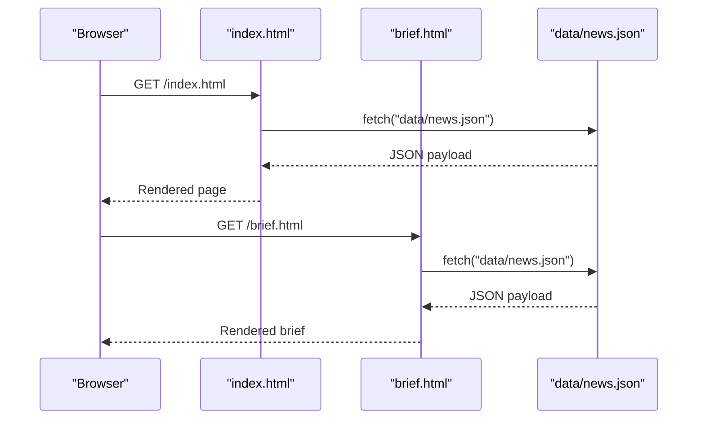
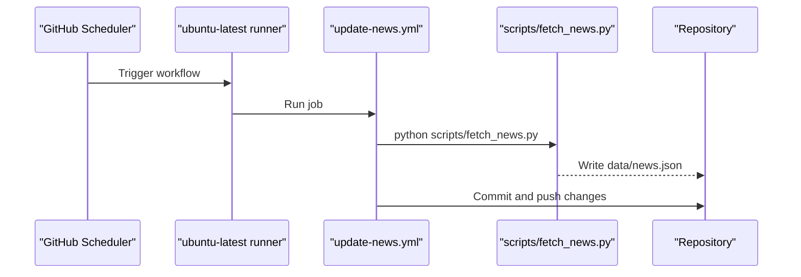
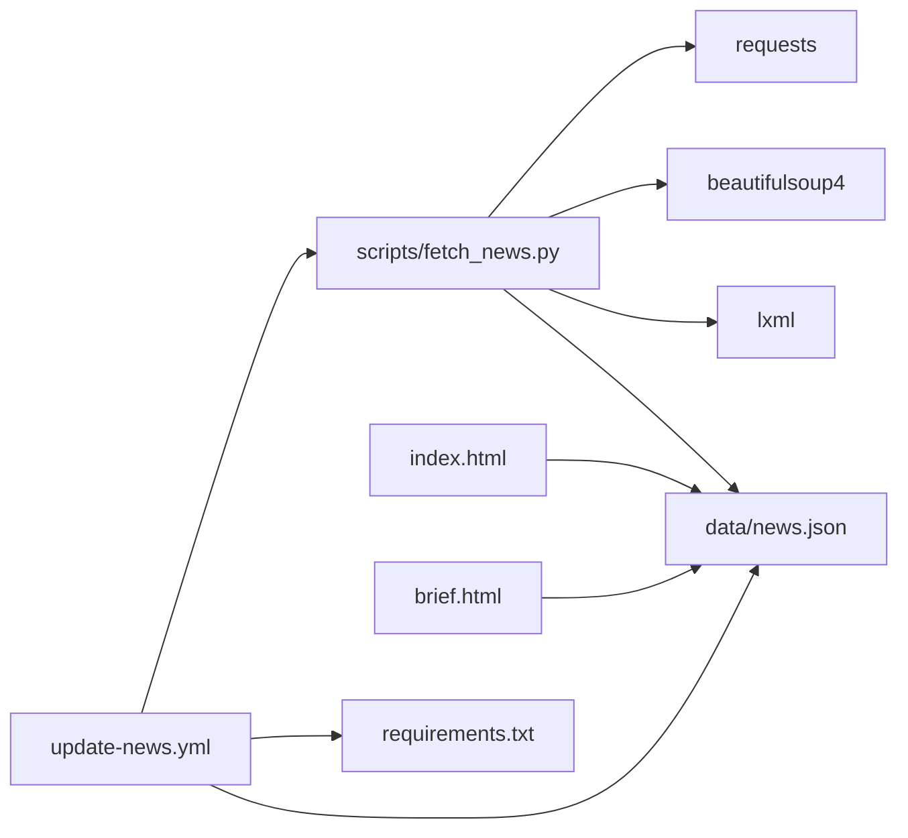

# Architecture & Design

<cite>
**Referenced Files in This Document**
- [README.md](file://README.md)
- [fetch_news.py](file://scripts/fetch_news.py)
- [news.json](file://data/news.json)
- [index.html](file://index.html)
- [brief.html](file://brief.html)
- [update-news.yml](file://.github/workflows/update-news.yml)
- [requirements.txt](file://requirements.txt)
- [push.sh](file://push.sh)
- [test_connections.py](file://test_connections.py)
- [test.py](file://test.py)
</cite>

## Table of Contents
1. [Introduction](#introduction)
2. [Project Structure](#project-structure)
3. [Core Components](#core-components)
4. [Architecture Overview](#architecture-overview)
5. [Detailed Component Analysis](#detailed-component-analysis)
6. [Dependency Analysis](#dependency-analysis)
7. [Performance Considerations](#performance-considerations)
8. [Troubleshooting Guide](#troubleshooting-guide)
9. [Conclusion](#conclusion)

## Introduction
This document describes the architecture and design of the Daily News system, a Python-based news aggregation pipeline feeding a static HTML/CSS/JavaScript frontend. It explains how external news sources are fetched and processed into a JSON dataset, how the frontend renders the data, and how GitHub Actions automates daily updates. The document also defines system boundaries, highlights separation of concerns across data collection, processing, and presentation layers, and documents technology stack choices and deployment topology using GitHub Pages.

## Project Structure
The repository is organized around three primary areas:
- scripts: Python-based news collection and processing logic
- data: JSON dataset persisted locally and served to the frontend
- docs, .github/workflows: documentation and CI automation
- Static frontend: index.html and brief.html for rendering news

**Diagram sources**
- [README.md:48-62](file://README.md#L48-L62)
- [update-news.yml:1-38](file://.github/workflows/update-news.yml#L1-L38)
- [index.html:282-295](file://index.html#L282-L295)
- [brief.html:381-399](file://brief.html#L381-L399)

**Section sources**
- [README.md:48-62](file://README.md#L48-L62)

## Core Components
- News Collection Engine (Python): Implements a fetcher class that scrapes RSS feeds and selected web pages, applies filtering and deduplication, computes synthetic metrics, and writes a structured JSON dataset.
- JSON Data Store: A single JSON file containing aggregated news items, metadata, and computed scores.
- Static HTML Frontend: Two pages:
  - index.html: Interactive list view with sorting and pagination-like selection of top/bottom entries.
  - brief.html: AI-focused “news brief” generator that categorizes and contextualizes top stories for researchers.
- Automation Workflow: GitHub Actions job scheduled to run daily, invoking the Python script and committing updated data.
- Local Utilities: Test scripts for connectivity and Reddit API exploration; a push script for manual deployments.

**Section sources**
- [fetch_news.py:12-16](file://scripts/fetch_news.py#L12-L16)
- [news.json:1-5](file://data/news.json#L1-L5)
- [index.html:277-416](file://index.html#L277-L416)
- [brief.html:372-768](file://brief.html#L372-L768)
- [update-news.yml:8-38](file://.github/workflows/update-news.yml#L8-L38)
- [requirements.txt:1-4](file://requirements.txt#L1-L4)
- [push.sh:1-60](file://push.sh#L1-L60)
- [test_connections.py:1-45](file://test_connections.py#L1-L45)
- [test.py:1-49](file://test.py#L1-L49)

## Architecture Overview
The system follows a classic pipeline:
- External sources (RSS and selected websites) are polled by the Python fetcher.
- The fetcher filters, normalizes, and enriches content, then writes a JSON dataset.
- The static frontend reads the JSON and renders interactive views.
- GitHub Actions orchestrates daily updates, committing changes to the repository.

**Diagram sources**
- [fetch_news.py:26-67](file://scripts/fetch_news.py#L26-L67)
- [news.json:1-5](file://data/news.json#L1-L5)
- [index.html:282-295](file://index.html#L282-L295)
- [brief.html:381-399](file://brief.html#L381-L399)
- [update-news.yml:28-30](file://.github/workflows/update-news.yml#L28-L30)

## Detailed Component Analysis

### Python News Fetcher
The fetcher encapsulates:
- Source configuration: RSS feeds and web selectors
- Robust HTTP fetching with retries and timeouts
- Content normalization and filtering (title cleaning, length bounds, keyword filtering)
- Synthetic metric computation (views, comments, forwards, favorites)
- Deduplication via MD5 hashing of titles
- Output to JSON with update timestamp and counts

**Diagram sources**
- [fetch_news.py:12-16](file://scripts/fetch_news.py#L12-L16)
- [fetch_news.py:26-67](file://scripts/fetch_news.py#L26-L67)
- [fetch_news.py:69-83](file://scripts/fetch_news.py#L69-L83)
- [fetch_news.py:84-191](file://scripts/fetch_news.py#L84-L191)
- [fetch_news.py:193-799](file://scripts/fetch_news.py#L193-L799)

Key processing logic:
- RSS ingestion: parse XML, extract items, normalize dates, filter by recency, compute synthetic metrics, and append to the list.
- Web scraping: fetch pages, extract titles and timestamps via selectors and meta tags, normalize time formats, and append to the list.
- Filtering: remove invalid titles, enforce length constraints, and exclude known boilerplate keywords.
- Deduplication: hash titles to produce stable IDs and prevent duplicates.
- Output: write a JSON file with metadata (update time, total count, sources) and a news array.

**Section sources**
- [fetch_news.py:26-67](file://scripts/fetch_news.py#L26-L67)
- [fetch_news.py:69-83](file://scripts/fetch_news.py#L69-L83)
- [fetch_news.py:84-191](file://scripts/fetch_news.py#L84-L191)
- [fetch_news.py:193-799](file://scripts/fetch_news.py#L193-L799)

### JSON Data Store
The dataset is a single JSON file with:
- Metadata: update_time, total_count, sources
- Array of news items: each item includes id, title, source, url, publish_time, views, comments, forwards, favorites, content, and hotness

**Diagram sources**
- [news.json:1-5](file://data/news.json#L1-L5)
- [news.json:6-18](file://data/news.json#L6-L18)

**Section sources**
- [news.json:1-5](file://data/news.json#L1-L5)
- [news.json:6-18](file://data/news.json#L6-L18)

### Static HTML Frontend
Two pages consume the JSON dataset:
- index.html: loads news.json, sorts by selected metric (hotness, views, comments, forwards, favorites), and displays top/bottom 20 entries with expandable details.
- brief.html: loads news.json, selects top stories, categorizes by topics, and generates a curated “researcher-focused” brief with insights and learning tracks.

**Diagram sources**
- [index.html:282-295](file://index.html#L282-L295)
- [brief.html:381-399](file://brief.html#L381-L399)

**Section sources**
- [index.html:277-416](file://index.html#L277-L416)
- [brief.html:372-768](file://brief.html#L372-L768)

### GitHub Actions Automation
The workflow:
- Schedules daily execution at UTC 23:00 (Beijing 07:00)
- Checks out the repository
- Sets up Python 3.11
- Installs dependencies from requirements.txt
- Runs the fetcher script
- Commits and pushes the updated data/news.json

**Diagram sources**
- [update-news.yml:3-6](file://.github/workflows/update-news.yml#L3-L6)
- [update-news.yml:18-30](file://.github/workflows/update-news.yml#L18-L30)
- [update-news.yml:32-37](file://.github/workflows/update-news.yml#L32-L37)

**Section sources**
- [update-news.yml:1-38](file://.github/workflows/update-news.yml#L1-L38)

### Technology Stack and Deployment Topology
- Backend runtime: Python 3.11
- Libraries: requests, beautifulsoup4, lxml
- Frontend: vanilla HTML/CSS/JavaScript
- Hosting: GitHub Pages (via repository pages)
- CI: GitHub Actions

**Section sources**
- [requirements.txt:1-4](file://requirements.txt#L1-L4)
- [update-news.yml:18-21](file://.github/workflows/update-news.yml#L18-L21)
- [README.md:30-36](file://README.md#L30-L36)

### System Boundaries and External Dependencies
- Internal system boundary: scripts/, data/, index.html, brief.html, .github/workflows/
- External dependencies:
  - RSS feeds and selected websites (web scraping)
  - GitHub Actions runner environment
  - GitHub Pages hosting

**Section sources**
- [fetch_news.py:26-67](file://scripts/fetch_news.py#L26-L67)
- [update-news.yml:18-21](file://.github/workflows/update-news.yml#L18-L21)
- [README.md:30-36](file://README.md#L30-L36)

## Dependency Analysis
- fetch_news.py depends on:
  - requests for HTTP operations
  - beautifulsoup4 and lxml for parsing
  - OS filesystem for writing data/news.json
- index.html and brief.html depend on:
  - data/news.json availability via local fetch
- update-news.yml depends on:
  - Python 3.11 environment
  - requirements.txt for dependencies
  - Git operations to commit and push

**Diagram sources**
- [fetch_news.py:1-11](file://scripts/fetch_news.py#L1-L11)
- [requirements.txt:1-4](file://requirements.txt#L1-L4)
- [index.html:282-295](file://index.html#L282-L295)
- [brief.html:381-399](file://brief.html#L381-L399)
- [update-news.yml:23-26](file://.github/workflows/update-news.yml#L23-L26)

**Section sources**
- [fetch_news.py:1-11](file://scripts/fetch_news.py#L1-L11)
- [requirements.txt:1-4](file://requirements.txt#L1-L4)
- [index.html:282-295](file://index.html#L282-L295)
- [brief.html:381-399](file://brief.html#L381-L399)
- [update-news.yml:23-26](file://.github/workflows/update-news.yml#L23-L26)

## Performance Considerations
- Network reliability: The fetcher implements retry logic and timeouts to handle transient failures.
- Parsing efficiency: BeautifulSoup with lxml parser is used for robust HTML/XML parsing.
- Dataset size: The JSON file contains a bounded set of recent items; rendering performance scales with the number of displayed items (top/bottom 20).
- Automation cadence: Daily updates balance freshness with resource usage.

[No sources needed since this section provides general guidance]

## Troubleshooting Guide
Common issues and remedies:
- Data loading errors in the browser:
  - Ensure data/news.json is present and readable by the server.
  - Verify the JSON structure matches expectations (metadata and news array).
- Network failures during scraping:
  - Check connectivity to external sources using the connectivity test script.
  - Review fetcher logs for HTTP exceptions and retry behavior.
- Automation failures:
  - Confirm Python version and dependencies are installed in the runner.
  - Validate that the fetcher script executes without errors and writes the dataset.
- Manual deployment conflicts:
  - Use the push script to resolve merge conflicts, especially for data/news.json.

**Section sources**
- [index.html:291-294](file://index.html#L291-L294)
- [brief.html:391-398](file://brief.html#L391-L398)
- [test_connections.py:1-45](file://test_connections.py#L1-L45)
- [update-news.yml:18-26](file://.github/workflows/update-news.yml#L18-L26)
- [push.sh:23-41](file://push.sh#L23-L41)

## Conclusion
The Daily News system cleanly separates concerns across data collection, processing, and presentation. The Python fetcher aggregates and normalizes content from RSS and selected websites, producing a JSON dataset consumed by static HTML pages. GitHub Actions automates daily updates, enabling a low-maintenance, cost-effective deployment on GitHub Pages. The architecture is straightforward, extensible, and suitable for continuous operation with minimal operational overhead.