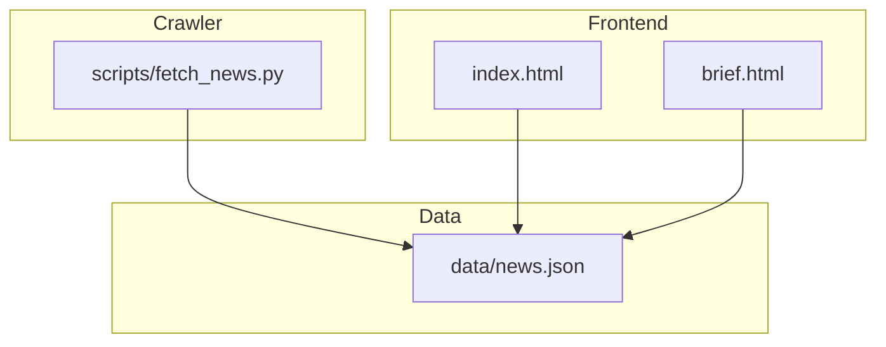
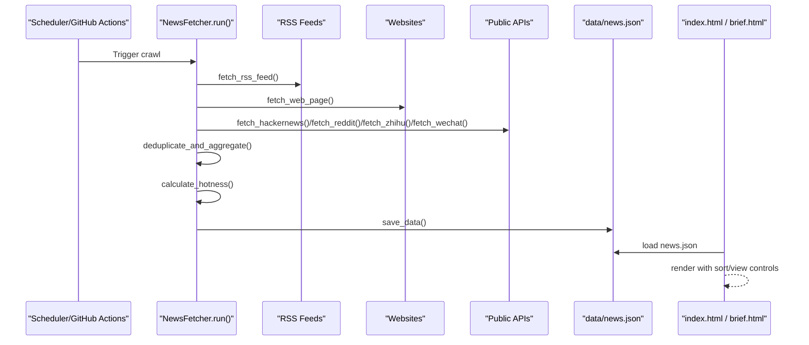
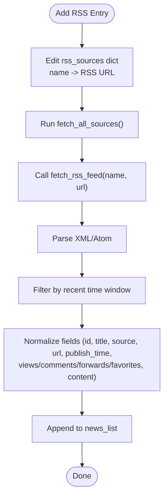
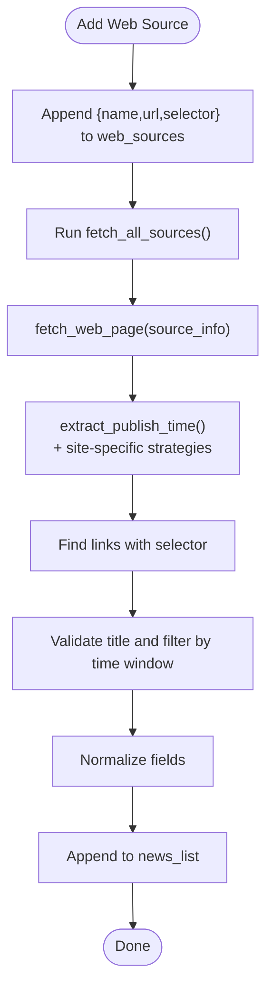
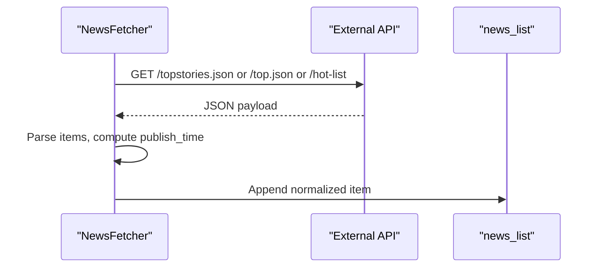
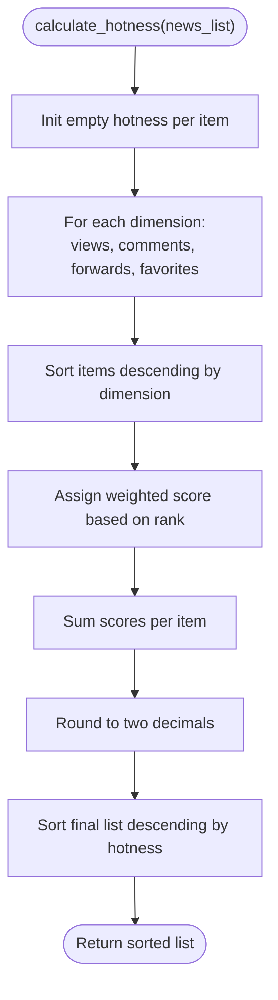
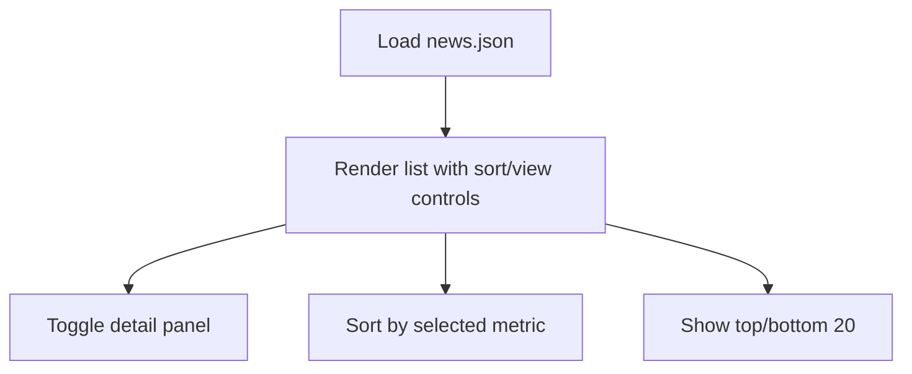
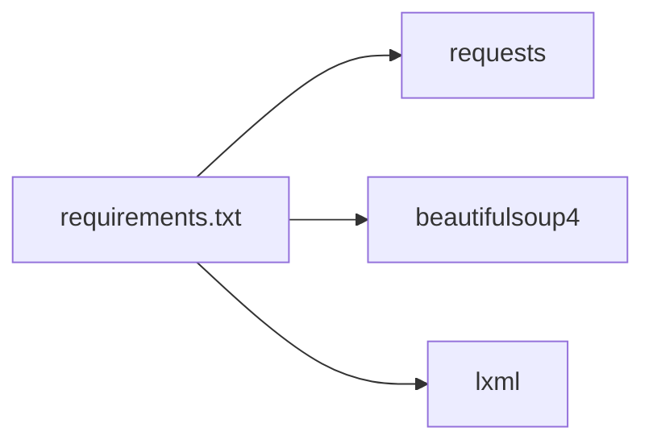

# Configuration & Customization

<cite>
**Referenced Files in This Document**
- [fetch_news.py](file://scripts/fetch_news.py)
- [index.html](file://index.html)
- [brief.html](file://brief.html)
- [news.json](file://data/news.json)
- [README.md](file://README.md)
- [requirements.txt](file://requirements.txt)
</cite>

## Table of Contents
1. [Introduction](#introduction)
2. [Project Structure](#project-structure)
3. [Core Components](#core-components)
4. [Architecture Overview](#architecture-overview)
5. [Detailed Component Analysis](#detailed-component-analysis)
6. [Dependency Analysis](#dependency-analysis)
7. [Performance Considerations](#performance-considerations)
8. [Troubleshooting Guide](#troubleshooting-guide)
9. [Conclusion](#conclusion)
10. [Appendices](#appendices)

## Introduction
This document explains how to configure and customize the Daily News system. It focuses on extending the system by adding new news sources, customizing sorting criteria, hotness scoring, and display preferences. It also covers configuration options for different source types (RSS feeds, web scraping, API endpoints), parameter customization for content filtering and date ranges, and guidelines to maintain compatibility with existing data structures and frontend rendering.

## Project Structure
The system consists of:
- A Python crawler script that aggregates news from multiple sources and writes JSON data
- A static HTML frontend that renders the aggregated news and supports sorting and viewing modes
- A JSON dataset that stores normalized news items with computed hotness scores

**Diagram sources**
- [fetch_news.py](file://scripts/fetch_news.py)
- [index.html](file://index.html)
- [brief.html](file://brief.html)
- [news.json](file://data/news.json)

**Section sources**
- [README.md](file://README.md)
- [requirements.txt](file://requirements.txt)

## Core Components
- NewsFetcher class orchestrates fetching from RSS, web pages, and public APIs, deduplication, aggregation, hotness calculation, and persistence.
- Frontend pages index.html and brief.html consume news.json and present it with sorting and view controls.

Key responsibilities:
- RSS ingestion via RSS feed URLs
- Web scraping with selector-based extraction and robust time parsing
- API-based ingestion (Hacker News, Reddit, Zhihu, WeChat)
- Deduplication and aggregation by normalized ID
- Hotness scoring across multiple dimensions
- JSON persistence and frontend consumption

**Section sources**
- [fetch_news.py](file://scripts/fetch_news.py)
- [index.html](file://index.html)
- [brief.html](file://brief.html)
- [news.json](file://data/news.json)

## Architecture Overview
The pipeline is a pull-based aggregation system:
- Sources are configured in the crawler
- Each fetch method normalizes items to a unified schema
- Items are deduplicated and aggregated
- Hotness is calculated and items are saved to news.json
- Frontends read news.json and render with interactive controls

**Diagram sources**
- [fetch_news.py](file://scripts/fetch_news.py)
- [index.html](file://index.html)
- [brief.html](file://brief.html)
- [news.json](file://data/news.json)

## Detailed Component Analysis

### RSS Sources Configuration
- Location: rss_sources dictionary
- How to add a new RSS source:
  - Add an entry with a human-readable name as the key and a valid RSS/Atom URL as the value
  - The fetch_rss_feed method will iterate over this dictionary and call the RSS parser
- Implementation notes:
  - The method parses XML/Atom, extracts titles, links, and dates, filters by recent publish time, and appends normalized items to the internal list
  - Titles are cleaned and validated before inclusion

**Diagram sources**
- [fetch_news.py](file://scripts/fetch_news.py)

**Section sources**
- [fetch_news.py](file://scripts/fetch_news.py)

### Web Scraping Sources Configuration
- Location: web_sources list of dicts
- How to add a new web source:
  - Append a dict with keys: name, url, selector
  - The fetch_web_page method will iterate over this list and scrape links
- Implementation notes:
  - Uses a robust time extraction strategy with site-specific parsers and fallbacks
  - Extracts links, validates titles, filters by time window, and builds normalized items
  - Supports visiting detail pages to refine publish time when available

**Diagram sources**
- [fetch_news.py](file://scripts/fetch_news.py)

**Section sources**
- [fetch_news.py](file://scripts/fetch_news.py)

### Public API Sources Configuration
- Supported APIs: Hacker News, Reddit, Zhihu, WeChat (via third-party aggregator)
- How to add a new API source:
  - Implement a new fetch_* method following the established pattern
  - Add a call to your method in fetch_all_sources()
  - Ensure the method normalizes items to the unified schema
- Implementation notes:
  - Methods handle rate limits, retries, and time normalization
  - Some APIs require special headers or parameters

**Diagram sources**
- [fetch_news.py](file://scripts/fetch_news.py)

**Section sources**
- [fetch_news.py](file://scripts/fetch_news.py)

### Sorting Criteria and Hotness Scoring
- Sorting controls:
  - index.html exposes buttons to sort by hotness, views, comments, forwards, favorites
  - brief.html sorts by hotness for highlights and internally categorizes content
- Hotness scoring:
  - calculate_hotness computes a composite score by ranking each dimension independently and summing weighted scores
  - The score is rounded and used to sort the final list

**Diagram sources**
- [fetch_news.py](file://scripts/fetch_news.py)
- [index.html](file://index.html)
- [brief.html](file://brief.html)

**Section sources**
- [fetch_news.py](file://scripts/fetch_news.py)
- [index.html](file://index.html)
- [brief.html](file://brief.html)

### Display Preferences and Filtering
- Frontend rendering:
  - index.html displays top/bottom 20 items, supports sorting by multiple metrics, and toggles detail panels
  - brief.html generates a curated report with categories and insights
- Filtering:
  - The crawler filters out empty titles and items older than 24 hours
  - Deduplication merges duplicates by ID and aggregates counts while preserving earliest publish time and source metadata

**Diagram sources**
- [index.html](file://index.html)
- [brief.html](file://brief.html)
- [news.json](file://data/news.json)

**Section sources**
- [index.html](file://index.html)
- [brief.html](file://brief.html)
- [news.json](file://data/news.json)

### Parameter Customization
- Content filtering:
  - Title cleaning and validation rules exclude short, overly long, or keyword-matching titles
  - Relative time parsing supports “X minutes/hours/days ago”
- Date ranges:
  - Items older than 24 hours are excluded during RSS and web scraping
- Source prioritization:
  - The order of calls in fetch_all_sources determines ingestion order; adjust timing and delays to balance freshness and stability
- Hotness weights:
  - The scoring algorithm assigns higher scores to higher ranks per dimension; tune by adjusting the number of items considered or by post-processing scores

**Section sources**
- [fetch_news.py](file://scripts/fetch_news.py)
- [index.html](file://index.html)
- [brief.html](file://brief.html)

### Maintaining Compatibility
- Data schema:
  - Ensure each normalized item includes: id, title, source, url, publish_time (ISO), views, comments, forwards, favorites, content
  - The frontend expects these fields; missing fields may cause rendering issues
- Frontend expectations:
  - index.html sorts by hotness by default and supports switching metrics
  - brief.html expects a top set of items and categorizes by keywords
- Persistence:
  - Save to data/news.json with the expected structure (update_time, total_count, sources, news)

**Section sources**
- [fetch_news.py](file://scripts/fetch_news.py)
- [index.html](file://index.html)
- [brief.html](file://brief.html)
- [news.json](file://data/news.json)

## Dependency Analysis
External libraries:
- requests, beautifulsoup4, lxml are required for HTTP requests, HTML/XML parsing, and robust selectors

**Diagram sources**
- [requirements.txt](file://requirements.txt)

**Section sources**
- [requirements.txt](file://requirements.txt)

## Performance Considerations
- Network reliability:
  - Retry logic with exponential backoff reduces transient failures
- Parsing efficiency:
  - Selectors and time parsing are optimized; avoid overly broad selectors to reduce DOM traversal
- Rate limiting:
  - Respect robots.txt and rate limits; stagger requests to external sites
- Memory footprint:
  - Deduplication and aggregation reduce memory usage by merging duplicates
- Rendering:
  - Limit rendered items to top 20 for performance-sensitive views

[No sources needed since this section provides general guidance]

## Troubleshooting Guide
Common issues and resolutions:
- Empty or stale data:
  - Verify network connectivity and that fetch_all_sources completes without exceptions
  - Confirm that news.json exists and contains recent update_time
- Titles filtered out:
  - Review title validation rules; adjust keywords or length thresholds if needed
- Incorrect or missing publish times:
  - For web sources, ensure the selector targets the correct element and site-specific time extraction is enabled
- Sorting anomalies:
  - Confirm that numeric fields (views, comments, etc.) are populated; missing fields can affect ordering
- Frontend not updating:
  - Clear browser cache or reload; confirm that data/news.json is being served from the correct path

**Section sources**
- [fetch_news.py](file://scripts/fetch_news.py)
- [index.html](file://index.html)
- [brief.html](file://brief.html)
- [news.json](file://data/news.json)

## Conclusion
By understanding the NewsFetcher’s configuration points and the frontend’s expectations, you can safely extend the system with new sources, customize sorting and scoring, and maintain compatibility with existing data structures and rendering. Always validate schema compliance and test both crawling and frontend rendering after changes.

[No sources needed since this section summarizes without analyzing specific files]

## Appendices

### A. Adding a New RSS Source
Steps:
- Add an entry to rss_sources
- Run the crawler to fetch and persist data
- Verify rendering in index.html and brief.html

**Section sources**
- [fetch_news.py](file://scripts/fetch_news.py)
- [index.html](file://index.html)
- [brief.html](file://brief.html)
- [news.json](file://data/news.json)

### B. Adding a New Web Source
Steps:
- Append a dict to web_sources with name, url, and selector
- Optionally add site-specific time extraction if the default strategy is insufficient
- Re-run the crawler and check results

**Section sources**
- [fetch_news.py](file://scripts/fetch_news.py)
- [index.html](file://index.html)
- [brief.html](file://brief.html)
- [news.json](file://data/news.json)

### C. Adding a New API Source
Steps:
- Implement a new fetch_* method following the existing pattern
- Register the method in fetch_all_sources
- Normalize items to the unified schema and verify persistence and rendering

**Section sources**
- [fetch_news.py](file://scripts/fetch_news.py)
- [index.html](file://index.html)
- [brief.html](file://brief.html)
- [news.json](file://data/news.json)

### D. Customizing Sorting and Hotness
- Sorting: Use the frontend buttons to switch among hotness, views, comments, forwards, favorites
- Hotness: Adjust scoring by tuning the number of items considered or by post-processing scores in the pipeline

**Section sources**
- [fetch_news.py](file://scripts/fetch_news.py)
- [index.html](file://index.html)
- [brief.html](file://brief.html)

### E. Parameter Tuning Checklist
- RSS: Validate feed URL and item freshness window
- Web: Confirm selector accuracy and time extraction logic
- API: Verify endpoint availability and rate limits
- Filtering: Adjust title validation and time thresholds
- Rendering: Ensure all required fields are present in news.json

**Section sources**
- [fetch_news.py](file://scripts/fetch_news.py)
- [index.html](file://index.html)
- [brief.html](file://brief.html)
- [news.json](file://data/news.json)