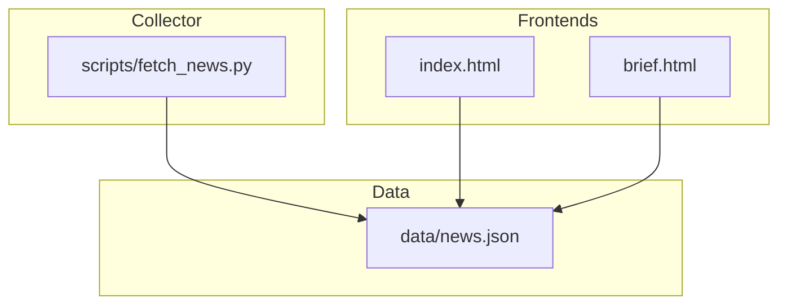
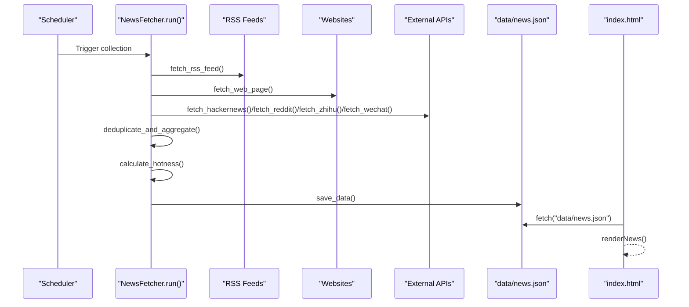
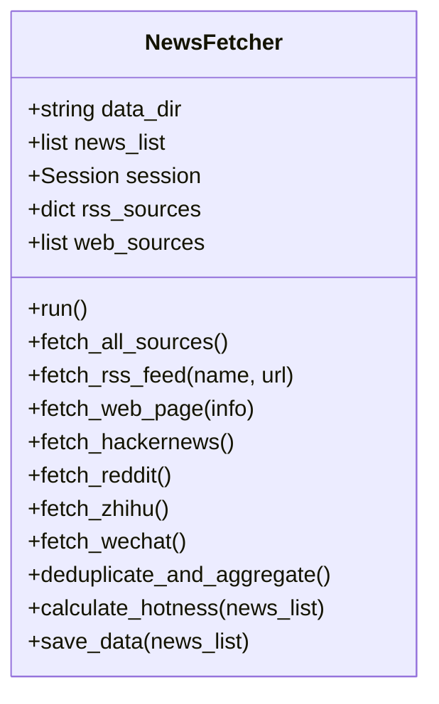
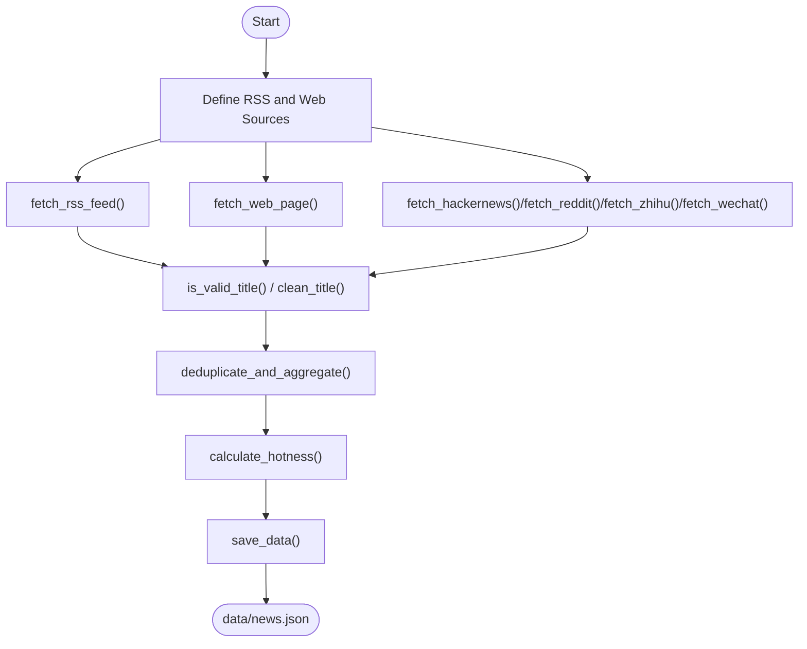
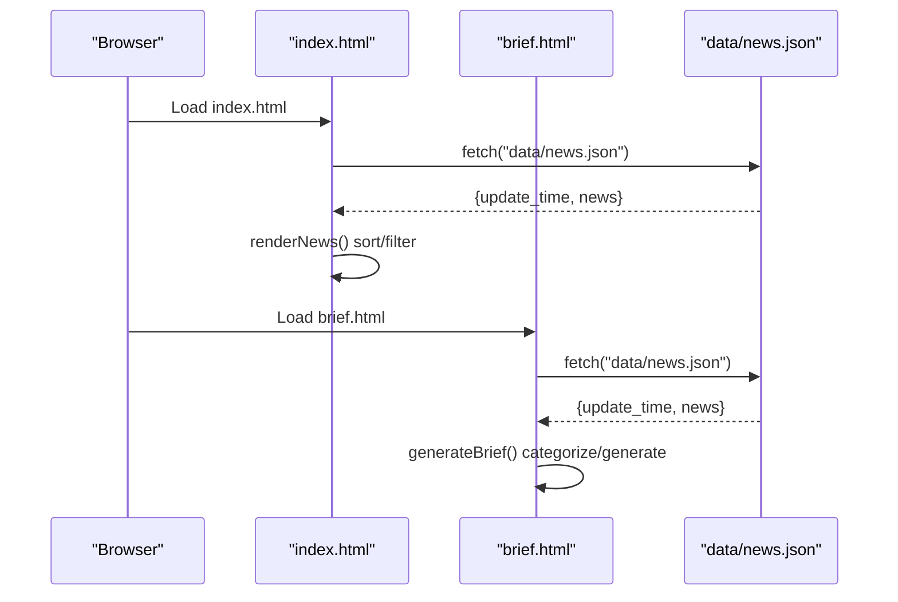
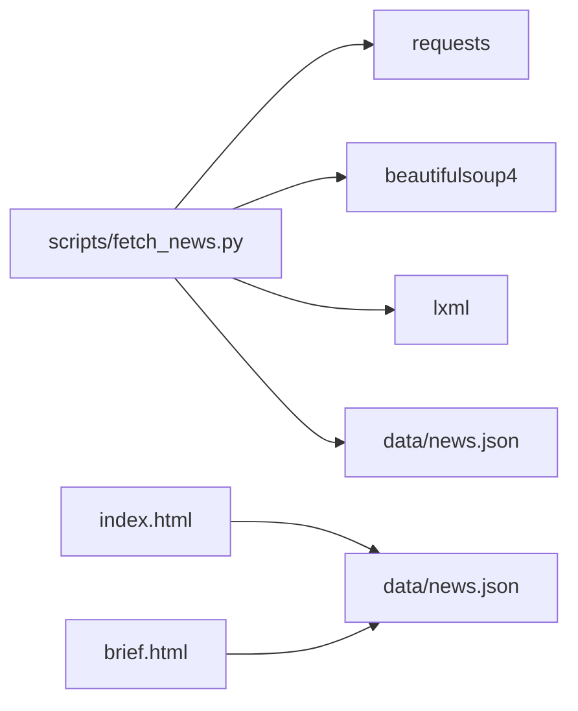

# Core Components

<cite>
**Referenced Files in This Document**
- [fetch_news.py](file://scripts/fetch_news.py)
- [index.html](file://index.html)
- [brief.html](file://brief.html)
- [news.json](file://data/news.json)
- [README.md](file://README.md)
</cite>

## Table of Contents
1. [Introduction](#introduction)
2. [Project Structure](#project-structure)
3. [Core Components](#core-components)
4. [Architecture Overview](#architecture-overview)
5. [Detailed Component Analysis](#detailed-component-analysis)
6. [Dependency Analysis](#dependency-analysis)
7. [Performance Considerations](#performance-considerations)
8. [Troubleshooting Guide](#troubleshooting-guide)
9. [Conclusion](#conclusion)

## Introduction
This document explains the core components of the Daily News system with a focus on:
- The News Collection Engine (scripts/fetch_news.py): multi-source ingestion (RSS, web scraping, APIs), content validation, deduplication, and hotness scoring.
- The Frontend Interfaces (index.html and brief.html): interactive sorting, viewing modes, responsive design, and rendering of the aggregated dataset.
It also details the end-to-end data pipeline from raw sources to the final JSON consumed by the frontend, and how the components collaborate to deliver a complete news aggregation experience.

## Project Structure
The repository is organized around a single Python news collector and two HTML interfaces:
- scripts/fetch_news.py: The News Collection Engine that scrapes, aggregates, scores, and persists news.
- index.html: The main interactive dashboard for browsing top/bottom trending stories.
- brief.html: An AI-powered summary interface tailored for researchers.
- data/news.json: The persisted dataset consumed by both frontends.
- README.md: Project overview and deployment guidance.

**Diagram sources**
- [fetch_news.py](file://scripts/fetch_news.py)
- [index.html](file://index.html)
- [brief.html](file://brief.html)
- [news.json](file://data/news.json)

**Section sources**
- [README.md](file://README.md)

## Core Components
This section focuses on the two primary functional areas: the News Collection Engine and the Frontend Interfaces.

### News Collection Engine (scripts/fetch_news.py)
The engine is implemented as a class-based pipeline that:
- Defines RSS and web sources
- Fetches and parses RSS feeds
- Scrapes websites with robust time extraction strategies
- Integrates external APIs (Hacker News, Reddit, Zhihu, WeChat)
- Validates titles and filters content
- Deduplicates entries
- Computes a composite hotness score
- Persists the final dataset to JSON

Key implementation highlights:
- Multi-source ingestion:
  - RSS: fetch_rss_feed iterates items, cleans titles, extracts timestamps, and builds normalized records.
  - Web scraping: fetch_web_page visits each configured site, extracts publication time via multiple strategies, validates titles, and collects links.
  - APIs: fetch_hackernews, fetch_reddit, fetch_zhihu, fetch_wechat pull structured data from public endpoints.
- Content validation:
  - is_valid_title applies length checks, keyword filtering, and ASCII heuristics to avoid noise.
  - clean_title removes CDATA and HTML tags.
- Duplicate detection and aggregation:
  - deduplicate_and_aggregate merges entries by ID, summing engagement metrics and preserving earliest publish time and source metadata.
- Hotness scoring:
  - calculate_hotness computes a dimension-wise ranking score across views, comments, forwards, and favorites, then normalizes and sorts.
- Persistence:
  - save_data writes update_time, total_count, sources, and the news array to data/news.json.

Concrete code references:
- RSS ingestion and title cleaning: [fetch_news.py](file://scripts/fetch_news.py)
- Web scraping and time extraction: [fetch_news.py](file://scripts/fetch_news.py)
- API integrations: [fetch_news.py](file://scripts/fetch_news.py)
- Deduplication and aggregation: [fetch_news.py](file://scripts/fetch_news.py)
- Hotness scoring: [fetch_news.py](file://scripts/fetch_news.py)
- Persistence: [fetch_news.py](file://scripts/fetch_news.py)

**Section sources**
- [fetch_news.py](file://scripts/fetch_news.py)

### Frontend Interfaces (index.html and brief.html)
Both interfaces consume the same dataset (data/news.json) and present it in distinct ways.

#### index.html
- Interactive controls:
  - Sort by hotness, views, comments, forwards, favorites.
  - View top/bottom 20 stories.
  - Open the AI Brief interface.
- Rendering:
  - Loads news from data/news.json, formats timestamps, and displays stats per item.
  - Click to expand/collapse content preview.
- Responsive design:
  - Adapts layout for mobile screens.

Concrete code references:
- Data loading and sorting: [index.html](file://index.html)
- Rendering and interactivity: [index.html](file://index.html)
- Responsive styles: [index.html](file://index.html)

**Section sources**
- [index.html](file://index.html)

#### brief.html
- AI-driven presentation:
  - Generates a curated report from the top stories.
  - Categorizes news by topics (tech, finance, science, etc.) and provides insights.
  - Offers learning tracks and action advice aligned with user profile.
- Loading and generation:
  - Loads news from data/news.json and generates HTML dynamically.

Concrete code references:
- Data loading and generation: [brief.html](file://brief.html)
- Categorization and insights: [brief.html](file://brief.html)
- Learning tracks and action advice: [brief.html](file://brief.html)

**Section sources**
- [brief.html](file://brief.html)

## Architecture Overview
The system follows a simple pipeline: collect → process → persist → render.

**Diagram sources**
- [fetch_news.py](file://scripts/fetch_news.py)
- [index.html](file://index.html)
- [news.json](file://data/news.json)

## Detailed Component Analysis

### NewsFetcher Class
The NewsFetcher orchestrates the entire pipeline. It maintains:
- Source catalogs (RSS and web)
- HTTP session with retry/backoff
- Data storage and persistence

**Diagram sources**
- [fetch_news.py](file://scripts/fetch_news.py)

**Section sources**
- [fetch_news.py](file://scripts/fetch_news.py)

### Data Processing Pipeline
End-to-end flow from raw sources to final JSON:

**Diagram sources**
- [fetch_news.py](file://scripts/fetch_news.py)

**Section sources**
- [fetch_news.py](file://scripts/fetch_news.py)

### Frontend Rendering Flow
How the frontend consumes and renders the dataset:

**Diagram sources**
- [index.html](file://index.html)
- [brief.html](file://brief.html)
- [news.json](file://data/news.json)

**Section sources**
- [index.html](file://index.html)
- [brief.html](file://brief.html)
- [news.json](file://data/news.json)

## Dependency Analysis
- Internal dependencies:
  - fetch_news.py depends on requests, BeautifulSoup, lxml, json, datetime, random, and hashlib.
  - The script writes to data/news.json under the data directory.
- External dependencies:
  - RSS feeds and websites for content.
  - Public APIs for Hacker News, Reddit, Zhihu, and WeChat.
- Frontend dependencies:
  - index.html and brief.html depend on data/news.json being present and served statically.

**Diagram sources**
- [fetch_news.py](file://scripts/fetch_news.py)
- [index.html](file://index.html)
- [brief.html](file://brief.html)
- [news.json](file://data/news.json)

**Section sources**
- [fetch_news.py](file://scripts/fetch_news.py)
- [index.html](file://index.html)
- [brief.html](file://brief.html)
- [news.json](file://data/news.json)

## Performance Considerations
- Network resilience:
  - Retry logic with exponential backoff reduces transient failures during scraping.
- Time extraction:
  - Multiple strategies (meta tags, site-specific selectors, relative time) improve robustness.
- Sorting and scoring:
  - Hotness computation scales with O(n·d) where d is the number of dimensions; acceptable for moderate n.
- Frontend rendering:
  - Sorting and slicing top/bottom 20 is efficient for typical datasets.

[No sources needed since this section provides general guidance]

## Troubleshooting Guide
Common issues and remedies:
- Empty or missing dataset:
  - Ensure the collector ran and saved data/news.json. Verify the scheduler or manual execution succeeded.
- Invalid or blocked sources:
  - Some sources may be temporarily unavailable or rate-limited. Adjust timeouts and retries.
- Time parsing errors:
  - The time extraction logic handles many formats; if a site changes markup, update selectors accordingly.
- Frontend not loading data:
  - Confirm data/news.json exists and is served statically. Check browser console for fetch errors.

**Section sources**
- [fetch_news.py](file://scripts/fetch_news.py)
- [index.html](file://index.html)
- [brief.html](file://brief.html)

## Conclusion
The Daily News system combines a robust, extensible News Collection Engine with two complementary Frontend Interfaces. The engine’s multi-source ingestion, validation, deduplication, and hotness scoring produce a high-quality dataset, while the frontends offer intuitive, responsive experiences for browsing and digesting the latest trends. Together, they form a complete pipeline from raw sources to actionable insights.