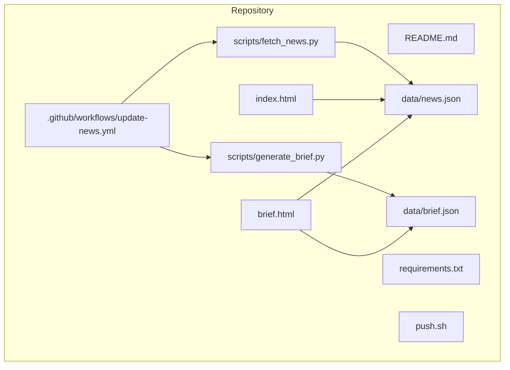
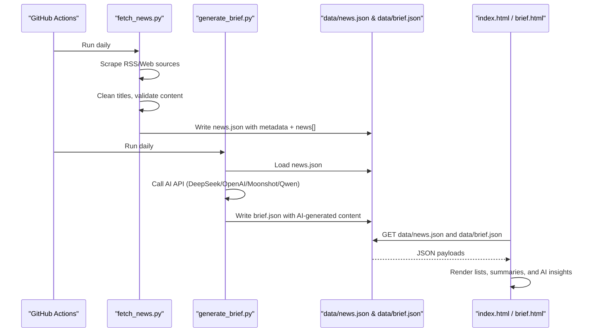
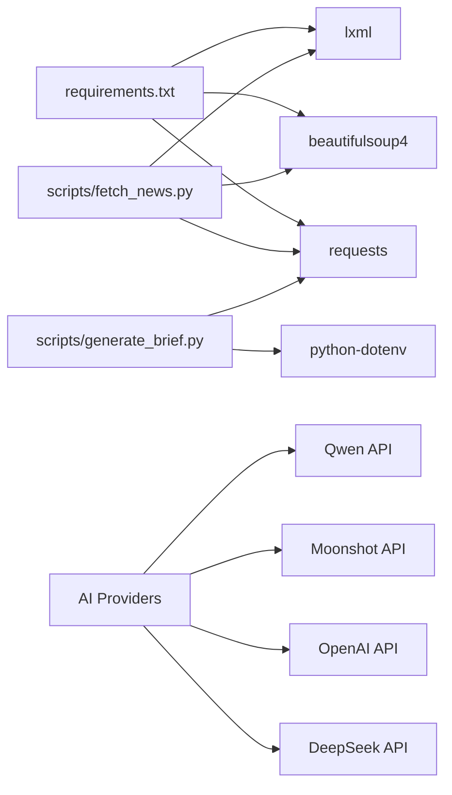
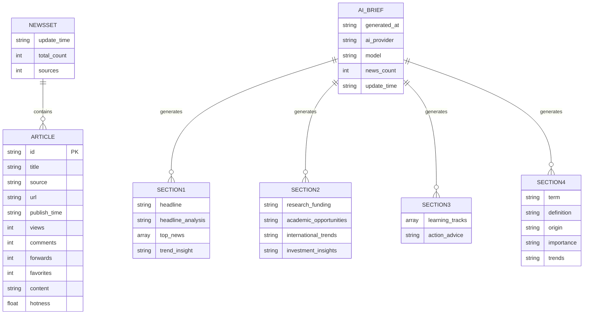

# Data Management

<cite>
**Referenced Files in This Document**
- [README.md](file://README.md)
- [.github/workflows/update-news.yml](file://.github/workflows/update-news.yml)
- [requirements.txt](file://requirements.txt)
- [scripts/fetch_news.py](file://scripts/fetch_news.py)
- [scripts/generate_brief.py](file://scripts/generate_brief.py)
- [data/news.json](file://data/news.json)
- [data/brief.json](file://data/brief.json)
- [index.html](file://index.html)
- [brief.html](file://brief.html)
- [push.sh](file://push.sh)
</cite>

## Update Summary
**Changes Made**
- Added new AI brief generation data structures and processing pipeline
- Documented the new brief.json schema with four-section structure
- Updated data model documentation to include AI-generated content metadata
- Enhanced data processing workflow with AI API integration
- Added new AI provider configuration and environment variable support
- Updated frontend integration to support both AI-generated and fallback brief formats

## Table of Contents
1. [Introduction](#introduction)
2. [Project Structure](#project-structure)
3. [Core Components](#core-components)
4. [Architecture Overview](#architecture-overview)
5. [Detailed Component Analysis](#detailed-component-analysis)
6. [Dependency Analysis](#dependency-analysis)
7. [Performance Considerations](#performance-considerations)
8. [Troubleshooting Guide](#troubleshooting-guide)
9. [Conclusion](#conclusion)
10. [Appendices](#appendices)

## Introduction
This document provides comprehensive data model documentation for the Daily News system, focusing on the JSON data structure and management practices. It covers the news article entity schema, system metadata, validation and cleaning rules, duplicate detection mechanisms, lifecycle management, access patterns, caching strategies, performance considerations, testing procedures, and backup/recovery guidelines. The system now includes AI-powered brief generation capabilities with enhanced data processing workflows.

## Project Structure
The Daily News system is organized around a static website that displays aggregated news from multiple sources, now enhanced with AI-generated brief content. Data is fetched periodically via a Python script, processed into JSON files, and rendered by HTML pages with AI-powered insights.

**Diagram sources**
- [README.md:48-62](file://README.md#L48-L62)
- [.github/workflows/update-news.yml:1-38](file://.github/workflows/update-news.yml#L1-L38)
- [requirements.txt:1-4](file://requirements.txt#L1-L4)
- [scripts/fetch_news.py:1-25](file://scripts/fetch_news.py#L1-L25)
- [scripts/generate_brief.py:1-252](file://scripts/generate_brief.py#L1-L252)
- [data/news.json:1-10](file://data/news.json#L1-L10)
- [data/brief.json:1-66](file://data/brief.json#L1-L66)
- [index.html:282-295](file://index.html#L282-L295)
- [brief.html:381-399](file://brief.html#L381-L399)

**Section sources**
- [README.md:48-62](file://README.md#L48-L62)

## Core Components
- Data model: A JSON document containing system metadata and a news array of article entities.
- Fetcher: A Python script that aggregates news from RSS feeds and selected web sources, cleans titles, validates content, and writes the JSON file.
- AI Brief Generator: A new component that processes news data through AI APIs to generate personalized brief content with four distinct sections.
- Frontend: Two HTML pages that read the JSON files and render news lists, summaries, and AI-generated insights.
- Automation: A GitHub Actions workflow that schedules daily updates, runs both fetching and AI brief generation, and commits changes.

Key JSON fields:
- System metadata: update_time, total_count, sources, news (array).
- Article entity: id, title, source, url, publish_time, views, comments, forwards, favorites, content, hotness.
- AI Brief metadata: generated_at, ai_provider, model, news_count, update_time (meta section).

Validation and cleaning rules are implemented in the fetcher to ensure consistent, usable data.

**Section sources**
- [data/news.json:1-10](file://data/news.json#L1-L10)
- [data/brief.json:59-65](file://data/brief.json#L59-L65)
- [scripts/fetch_news.py:127-147](file://scripts/fetch_news.py#L127-L147)
- [scripts/fetch_news.py:161-191](file://scripts/fetch_news.py#L161-L191)
- [scripts/generate_brief.py:30-58](file://scripts/generate_brief.py#L30-L58)

## Architecture Overview
The system follows an enhanced pipeline: data ingestion -> processing -> AI analysis -> storage -> presentation.

**Diagram sources**
- [.github/workflows/update-news.yml:28-37](file://.github/workflows/update-news.yml#L28-L37)
- [scripts/fetch_news.py:87-151](file://scripts/fetch_news.py#L87-L151)
- [scripts/generate_brief.py:119-217](file://scripts/generate_brief.py#L119-L217)
- [data/news.json:1-10](file://data/news.json#L1-L10)
- [data/brief.json:1-66](file://data/brief.json#L1-L66)
- [index.html:282-295](file://index.html#L282-L295)
- [brief.html:381-399](file://brief.html#L381-L399)

## Detailed Component Analysis

### Data Model: System Metadata
- update_time: ISO timestamp indicating the last update of the dataset.
- total_count: Integer count of articles in the news array.
- sources: Integer count of distinct sources contributing to the dataset.
- news: Array of article entities.

These fields are written by the fetcher and consumed by the frontend to display freshness and totals.

**Section sources**
- [data/news.json:2-4](file://data/news.json#L2-L4)
- [scripts/fetch_news.py:127-147](file://scripts/fetch_news.py#L127-L147)

### Data Model: Article Entity
Article fields:
- id: Unique identifier derived from the title hash.
- title: Cleaned headline text.
- source: Originating news outlet or platform.
- url: Link to the original article.
- publish_time: ISO timestamp of publication.
- views: Numeric page/view metric.
- comments: Numeric comment count.
- forwards: Numeric share/forward metric.
- favorites: Numeric favorite/save metric.
- content: Extracted article content or description.
- hotness: Composite score computed from metrics.

Validation and cleaning:
- Title cleaning removes CDATA and HTML tags; enforces length and keyword filters.
- Content extraction handles RSS descriptions and web meta tags.
- Metrics are randomized placeholders in the current implementation.

Duplicate detection:
- The fetcher computes a deterministic id from the cleaned title, enabling de-duplication at ingestion time.

Hotness scoring:
- The README describes a multi-factor scoring mechanism combining views, comments, forwards, favorites, and recency. The current dataset includes a hotness field; the exact formula is not embedded in the repository files.

**Section sources**
- [data/news.json:6-17](file://data/news.json#L6-L17)
- [scripts/fetch_news.py:87-151](file://scripts/fetch_news.py#L87-L151)
- [scripts/fetch_news.py:153-191](file://scripts/fetch_news.py#L153-L191)
- [README.md:9](file://README.md#L9)

### Data Model: AI Brief Structure
The AI brief system introduces a new data structure designed for personalized insights:

#### Section 1: Headline Focus
- headline: Primary news story highlighting
- headline_analysis: Deep analysis of the story's significance and implications
- top_news: Array of 3 most relevant news items with relevance explanations
- trend_insight: Macro trend analysis based on the day's news

#### Section 2: Research & Career Insights
- research_funding: Funding opportunity analysis and policy guidance
- academic_opportunities: Academic collaboration and career development insights
- international_trends: International relations impact on research and collaboration
- investment_insights: Personal finance and investment recommendations tailored for researchers

#### Section 3: Learning & Action Plan
- learning_tracks: 3 recommended learning topics with practical applications
- action_advice: Specific weekly action items for research, investment, and personal development

#### Section 4: Knowledge Expansion
- term: Key concept extracted from the news
- definition: Precise definition of the concept
- origin: Historical development and key milestones
- importance: Why this matters for researchers
- trends: Future development trajectory

#### Meta Information
- generated_at: Timestamp when the AI brief was generated
- ai_provider: Name of the AI service provider used
- model: Specific model version/configuration
- news_count: Number of news items processed
- update_time: Reference to the original news dataset timestamp

**Section sources**
- [data/brief.json:1-66](file://data/brief.json#L1-L66)
- [scripts/generate_brief.py:125-180](file://scripts/generate_brief.py#L125-L180)
- [scripts/generate_brief.py:209-215](file://scripts/generate_brief.py#L209-L215)

### AI Provider Configuration and API Integration
The system supports multiple AI providers with configurable endpoints:

- DeepSeek: Default provider with configurable base URL and model
- OpenAI: Alternative provider with compatible API structure
- Moonshot: Chinese provider optimized for Chinese content
- Qwen: Alibaba Cloud's Tongyi series models

Configuration is handled through environment variables:
- DEFAULT_AI_PROVIDER: Selects active provider (deepseek/openai/moonshot/qwen)
- DEEPSEEK_API_KEY/OPENAI_API_KEY/MOONSHOT_API_KEY/QWEN_API_KEY: Authentication keys
- DEEPSEEK_BASE_URL/OPENAI_BASE_URL/MOONSHOT_BASE_URL/QWEN_BASE_URL: Custom endpoints
- DEEPSEEK_MODEL/OPENAI_MODEL/MOONSHOT_MODEL/QWEN_MODEL: Specific model selection

**Section sources**
- [scripts/generate_brief.py:36-58](file://scripts/generate_brief.py#L36-L58)
- [scripts/generate_brief.py:86-117](file://scripts/generate_brief.py#L86-L117)

### Data Validation Rules
- Title filtering:
  - Minimum and maximum length thresholds.
  - Exclusion of generic keywords and boilerplate phrases.
  - Exclusion of pure ASCII titles without extended characters.
- Content extraction:
  - RSS descriptions and encoded content are normalized.
  - Web pages parse meta tags and structured selectors for timestamps.
- Metric normalization:
  - Views, comments, forwards, favorites are integers; randomized in current implementation.
- AI Response Processing:
  - Automatic JSON parsing with fallback for malformed responses.
  - Markdown code block stripping for clean JSON extraction.

**Section sources**
- [scripts/fetch_news.py:161-191](file://scripts/fetch_news.py#L161-L191)
- [scripts/fetch_news.py:137-146](file://scripts/fetch_news.py#L137-L146)
- [scripts/generate_brief.py:186-206](file://scripts/generate_brief.py#L186-L206)

### Duplicate Detection Mechanisms
- Deterministic hashing of cleaned titles produces stable ids.
- This approach prevents duplicate articles with identical titles from appearing in the dataset.

**Section sources**
- [scripts/fetch_news.py:84](file://scripts/fetch_news.py#L84)
- [scripts/fetch_news.py:127-129](file://scripts/fetch_news.py#L127-L129)

### Data Lifecycle Management
- Generation: Periodic scraping of RSS and web sources; writing to data/news.json.
- AI Processing: Daily AI brief generation using the latest news data.
- Storage: Separate JSON files for raw news data and AI-generated briefs.
- Rotation: Not implemented; the dataset is overwritten on each run.
- Cleanup: No automated pruning; retention governed by the single-file model.

Automation:
- Scheduled daily execution via GitHub Actions.
- Manual dispatch capability.
- Dual-stage processing: fetch_news.py followed by generate_brief.py.

**Section sources**
- [.github/workflows/update-news.yml:3-6](file://.github/workflows/update-news.yml#L3-L6)
- [.github/workflows/update-news.yml:28-37](file://.github/workflows/update-news.yml#L28-L37)
- [README.md:37-46](file://README.md#L37-L46)
- [scripts/generate_brief.py:226-241](file://scripts/generate_brief.py#L226-L241)

### Data Access Patterns and Presentation
- Frontend reads data/news.json and renders:
  - Top/bottom lists sorted by various metrics (hotness, views, comments, forwards, favorites).
  - Optional detail view with content and links.
- AI Brief page reads data/brief.json and renders:
  - Four-section AI-generated insights with personalized recommendations.
  - Fallback to basic news rendering if AI brief is unavailable.
- Brief page generates curated insights based on top articles and categorization.

Caching:
- No explicit cache headers are set in the repository; browsers rely on default caching behavior. The dataset is small and updated daily, minimizing stale content risk.

**Section sources**
- [index.html:282-295](file://index.html#L282-L295)
- [index.html:297-371](file://index.html#L297-L371)
- [brief.html:381-399](file://brief.html#L381-L399)
- [brief.html:401-505](file://brief.html#L401-L505)
- [brief.html:381-400](file://brief.html#L381-L400)

### Sample Data Examples
Below are representative entries from the dataset demonstrating typical field values. These examples reflect the current structure and placeholder metrics.

- Example 1:
  - id: "8df233bb73e6ebac76238e535c71c578"
  - title: "Employee lends account to trade stocks Bohai Securities receives regulatory warning"
  - source: "China Securities Journal"
  - url: "https://www.cs.com.cn/qs/2026/04/05/detail_2026040510001836.html"
  - publish_time: "2026-04-07T16:22:00"
  - views: 63060
  - comments: 3812
  - forwards: 1922
  - favorites: 2872
  - content: ""
  - hotness: 70.99

- Example 2:
  - id: "b7c8f18cd990afab4c308aeee2baaa96"
  - title: "European indices open higher | FTSE 100 up 0.17%, CAC 40 up 0.47%, DAX 30 up 0.10%, Milan MIB up 0.40%."
  - source: "First Financial"
  - url: "https://www.yicai.com/brief/103121099.html"
  - publish_time: "2026-04-07T15:27:04.644170"
  - views: 91683
  - comments: 2590
  - forwards: 1750
  - favorites: 2751
  - content: ""
  - hotness: 69.01

- Example 3:
  - id: "707b11723ada53f785a77b29de8d3e26"
  - title: "Dongying Huiyang green lithium battery new energy industry investment fund registered"
  - source: "36Kr"
  - url: ""
  - publish_time: "2026-04-07T15:26:50.523192"
  - views: 78235
  - comments: 3681
  - forwards: 1618
  - favorites: 2209
  - content: ""
  - hotness: 67.25

AI Brief Example (partial):
- section1.headline: "Middle East Tensions Escalate as Iran-US Relations Enter Critical Phase"
- section1.headline_analysis: "This news highlights the potential risks and uncertainties in Middle Eastern geopolitics, affecting global energy markets, technology cooperation, and international scientific exchange. The underlying cause lies in the continuing strategic rivalry between the US and Iran, while Pakistan's role as mediator underscores its importance in regional affairs. For 40-year-old researchers, this may mean changes in international collaboration opportunities, shifts in research funding flows, and uncertainty in overseas academic exchanges, requiring close attention."
- section2.research_funding: "Today's news mentioning Dongying Huiyang Green Lithium Battery New Energy Industry Investment Fund, Hongxiong AI financing, and Tsinghua-affiliated mineral AI sorting machine C-round financing, among others, all indicate strong activity in the new energy and artificial intelligence sectors. At the policy level, the country's support for strategic emerging industries such as new energy, high-end manufacturing, and AI continues to strengthen. Researchers should pay attention to funding opportunities in these fields, particularly combining them with local characteristics. Specific applications include the National Natural Science Foundation, Major Scientific and Technological Projects, local government industrial guidance funds, while strengthening cooperation with enterprises and parks to improve project landing possibilities."

These examples illustrate the presence of empty content fields and placeholder metrics, consistent with the current dataset.

**Section sources**
- [data/news.json:6-17](file://data/news.json#L6-L17)
- [data/news.json:19-31](file://data/news.json#L19-L31)
- [data/news.json:32-44](file://data/news.json#L32-L44)
- [data/brief.json:2-23](file://data/brief.json#L2-L23)

### Data Validation Testing Procedures and Quality Assurance
- Unit-level checks:
  - Title cleaning and filtering logic verified by the fetcher's validation routines.
  - RSS and web parsing robustness tested via retries and fallback strategies.
  - AI response parsing validated with JSON extraction and fallback mechanisms.
- Integration-level checks:
  - Frontend rendering validated by loading data/news.json and data/brief.json and verifying sort controls and detail toggles.
  - AI brief rendering tested with both AI-generated and fallback content modes.
- Manual QA:
  - Inspect brief.html for categorized insights and tag generation.
  - Confirm update_time reflects recent processing.
  - Verify AI provider configuration and API response handling.

**Section sources**
- [scripts/fetch_news.py:69-83](file://scripts/fetch_news.py#L69-L83)
- [scripts/fetch_news.py:153-191](file://scripts/fetch_news.py#L153-L191)
- [scripts/generate_brief.py:186-206](file://scripts/generate_brief.py#L186-L206)
- [index.html:297-371](file://index.html#L297-L371)
- [brief.html:401-505](file://brief.html#L401-L505)

### Backup, Migration, and Recovery
- Backup:
  - Commit and push changes via the provided script to preserve dataset history.
  - Both news.json and brief.json are tracked in version control.
- Migration:
  - To a new host or branch, clone the repository and ensure the data directory exists.
  - Configure AI provider environment variables for brief generation.
- Recovery:
  - Re-run the fetcher locally or trigger the GitHub Actions workflow to regenerate data/news.json.
  - Regenerate AI briefs by running generate_brief.py or triggering the workflow.

**Section sources**
- [push.sh:1-60](file://push.sh#L1-L60)
- [.github/workflows/update-news.yml:28-37](file://.github/workflows/update-news.yml#L28-L37)

## Dependency Analysis
External dependencies are minimal and focused on web scraping, parsing, and AI API integration.

**Diagram sources**
- [requirements.txt:1-4](file://requirements.txt#L1-L4)
- [scripts/fetch_news.py:1-11](file://scripts/fetch_news.py#L1-L11)
- [scripts/generate_brief.py:18-25](file://scripts/generate_brief.py#L18-L25)

**Section sources**
- [requirements.txt:1-4](file://requirements.txt#L1-L4)
- [scripts/fetch_news.py:1-11](file://scripts/fetch_news.py#L1-L11)
- [scripts/generate_brief.py:18-25](file://scripts/generate_brief.py#L18-L25)

## Performance Considerations
- Dataset size: The current dataset contains hundreds of articles; sorting and rendering remain efficient for a static HTML site.
- Network latency: Retry logic and timeouts reduce failure rates during scraping and AI API calls.
- AI Processing: Brief generation adds processing overhead but provides significant value through personalized insights.
- Rendering: Sorting and pagination (top/bottom 20) keep the UI responsive.
- Recommendations:
  - Consider precomputing hotness scores server-side if the dataset grows substantially.
  - Add cache headers or CDN for faster delivery if hosting externally.
  - Implement incremental updates to avoid rewriting the entire dataset.
  - Optimize AI API calls with proper rate limiting and error handling.

## Troubleshooting Guide
Common issues and resolutions:
- Data not updating:
  - Verify GitHub Actions schedule and manual dispatch.
  - Check network connectivity and retry logic in the fetcher.
  - Ensure AI provider API keys are properly configured.
- Empty or missing content:
  - Review content extraction logic for specific sources.
  - Ensure selectors and meta tags are still valid.
  - Verify AI API responses are being parsed correctly.
- AI Brief generation failures:
  - Check AI provider configuration and API key validity.
  - Monitor API rate limits and quota usage.
  - Verify environment variable configuration.
- Frontend errors:
  - Confirm data/news.json and data/brief.json are present and readable.
  - Validate JSON formatting and required fields.
  - Check browser console for JavaScript errors in brief rendering.

**Section sources**
- [.github/workflows/update-news.yml:3-6](file://.github/workflows/update-news.yml#L3-L6)
- [scripts/fetch_news.py:69-83](file://scripts/fetch_news.py#L69-L83)
- [scripts/generate_brief.py:57-58](file://scripts/generate_brief.py#L57-L58)
- [index.html:282-295](file://index.html#L282-L295)
- [brief.html:381-399](file://brief.html#L381-L399)

## Conclusion
The Daily News system employs a straightforward, maintainable data model centered on a single JSON file, now enhanced with AI-powered brief generation capabilities. The fetcher enforces validation and cleaning rules, uses deterministic hashing for duplicates, and exposes a simple metadata schema. The new AI brief generation system provides personalized insights through configurable AI providers, adding significant value for researchers. The frontend consumes both raw news data and AI-generated briefs to deliver interactive, sortable news lists and curated summaries. While the current lifecycle is simple (overwrite on each run), the architecture supports easy extension for rotation, caching, and advanced scoring, with the added benefit of AI-driven content analysis.

## Appendices

### Appendix A: Data Model Schema

**Diagram sources**
- [data/news.json:1-10](file://data/news.json#L1-L10)
- [data/news.json:6-17](file://data/news.json#L6-L17)
- [data/brief.json:1-66](file://data/brief.json#L1-L66)

### Appendix B: AI Provider Configuration
The system supports multiple AI providers with the following configuration options:

- **DeepSeek**: Default provider with `deepseek-chat` model
- **OpenAI**: Compatible with `gpt-4o-mini` model  
- **Moonshot**: Chinese provider with `moonshot-v1-8k` model
- **Qwen**: Alibaba Cloud with `qwen-turbo` model

Configuration requires setting appropriate environment variables for each provider type.

**Section sources**
- [scripts/generate_brief.py:36-58](file://scripts/generate_brief.py#L36-L58)
- [scripts/generate_brief.py:226-241](file://scripts/generate_brief.py#L226-L241)