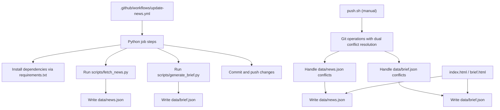
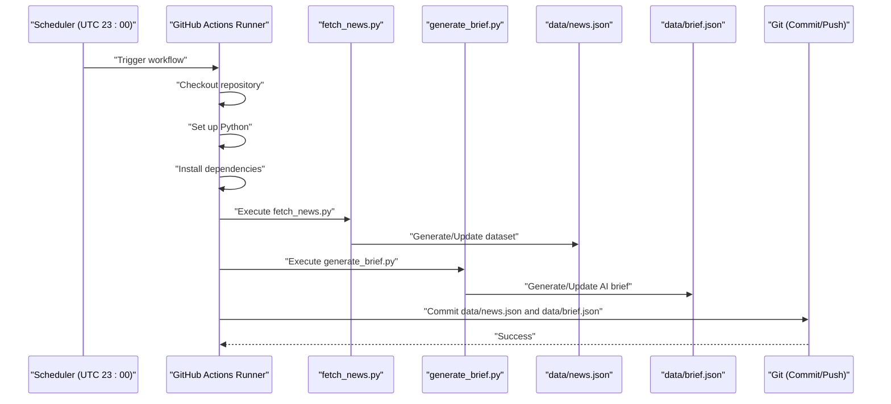
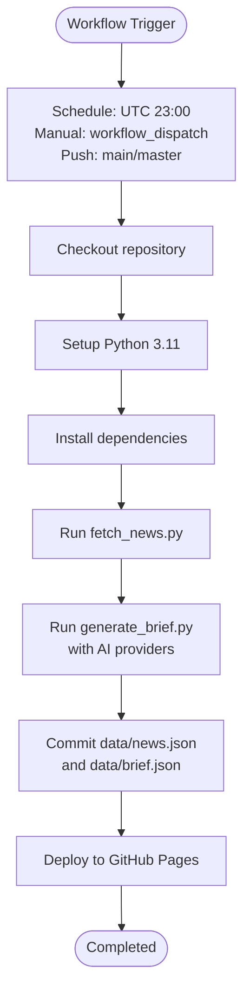
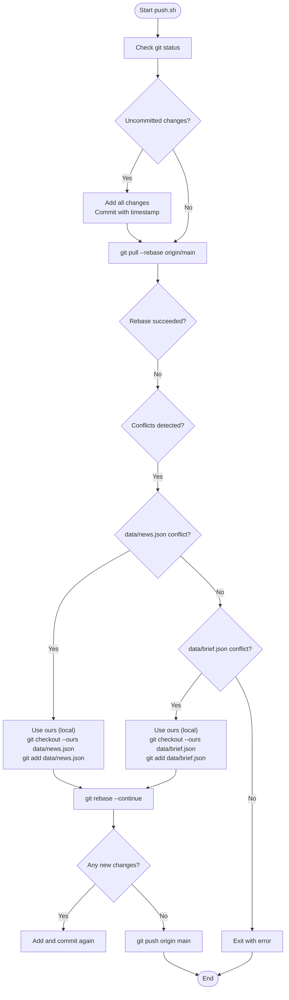
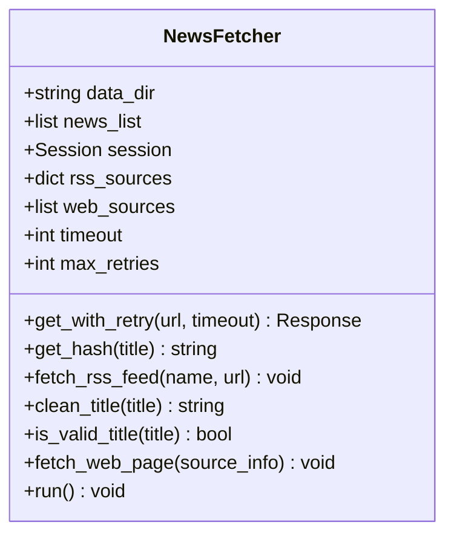
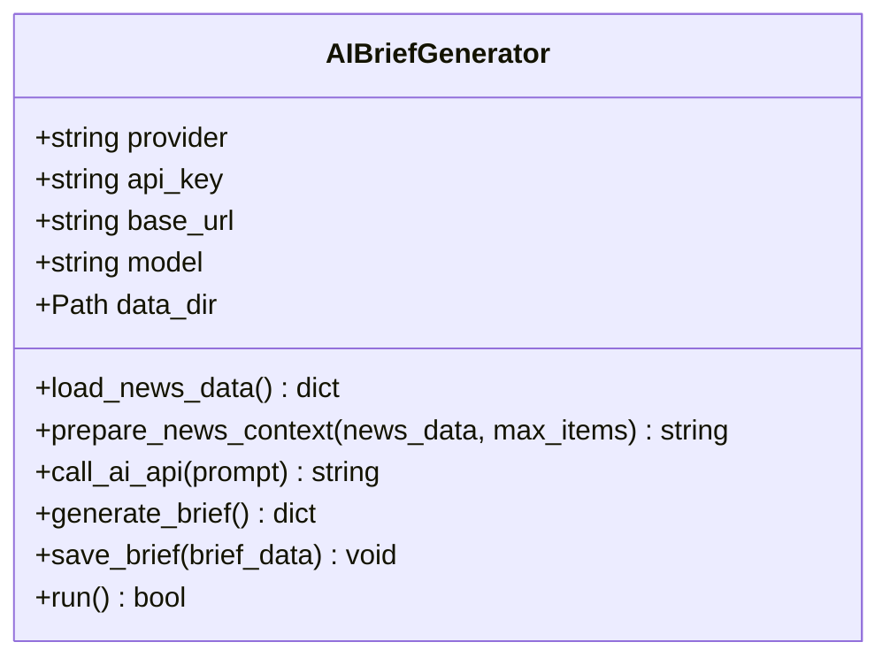
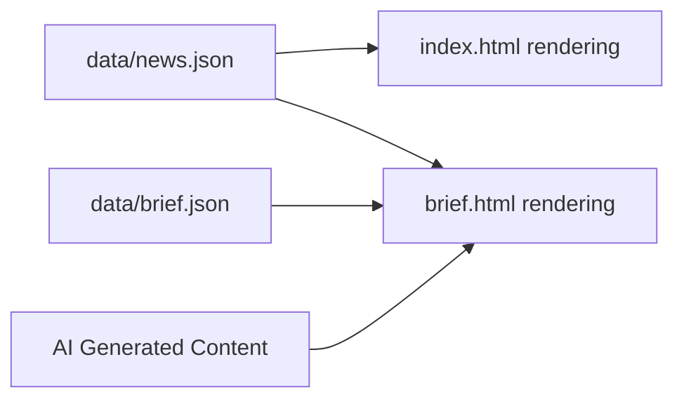
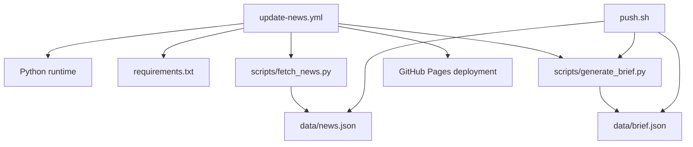

# Deployment & Automation

<cite>
**Referenced Files in This Document**
- [update-news.yml](file://.github/workflows/update-news.yml)
- [push.sh](file://push.sh)
- [fetch_news.py](file://scripts/fetch_news.py)
- [generate_brief.py](file://scripts/generate_brief.py)
- [README.md](file://README.md)
- [requirements.txt](file://requirements.txt)
- [news.json](file://data/news.json)
- [brief.json](file://data/brief.json)
- [index.html](file://index.html)
- [brief.html](file://brief.html)
- [test_connections.py](file://test_connections.py)
</cite>

## Update Summary
**Changes Made**
- Enhanced GitHub Actions workflow with new AI brief generation job
- Added comprehensive AI-powered news analysis and personalization
- Improved deployment pipeline with dual data file management
- Updated HTML rendering to support AI-generated content
- Expanded automation capabilities with multiple deployment targets

## Table of Contents
1. [Introduction](#introduction)
2. [Project Structure](#project-structure)
3. [Core Components](#core-components)
4. [Architecture Overview](#architecture-overview)
5. [Detailed Component Analysis](#detailed-component-analysis)
6. [Dependency Analysis](#dependency-analysis)
7. [Performance Considerations](#performance-considerations)
8. [Troubleshooting Guide](#troubleshooting-guide)
9. [Conclusion](#conclusion)
10. [Appendices](#appendices)

## Introduction
This document explains the deployment and automation system for the daily news project. The system has been enhanced with AI-powered news analysis and personalization capabilities, featuring an automated GitHub Actions workflow that runs daily to collect news, generate AI briefs, and automatically commit and push updates. It also documents the manual deployment script for local and emergency updates, GitHub Pages configuration, secrets and triggers, troubleshooting, customization, and best practices for production-grade deployments.

## Project Structure
The repository is organized around an enhanced GitHub Actions workflow, Python news fetching and AI generation scripts, static HTML pages, and JSON datasets. The key elements for deployment and automation are:

- Enhanced workflow definition under .github/workflows/update-news.yml
- Manual deployment script push.sh with dual data file handling
- News fetching logic in scripts/fetch_news.py
- AI brief generation in scripts/generate_brief.py
- Static pages index.html and brief.html
- Datasets data/news.json and data/brief.json
- Dependencies in requirements.txt
- Project documentation in README.md

**Diagram sources**
- [update-news.yml:1-94](file://.github/workflows/update-news.yml#L1-L94)
- [requirements.txt:1-5](file://requirements.txt#L1-L5)
- [fetch_news.py:1-2222](file://scripts/fetch_news.py#L1-L2222)
- [generate_brief.py:1-252](file://scripts/generate_brief.py#L1-L252)
- [news.json:1-66](file://data/news.json#L1-L66)
- [brief.json:1-66](file://data/brief.json#L1-L66)
- [index.html:1-900](file://index.html#L1-L900)
- [brief.html:1-900](file://brief.html#L1-L900)
- [push.sh:1-73](file://push.sh#L1-L73)

**Section sources**
- [README.md:30-47](file://README.md#L30-L47)
- [update-news.yml:1-94](file://.github/workflows/update-news.yml#L1-L94)
- [requirements.txt:1-5](file://requirements.txt#L1-L5)
- [fetch_news.py:1-2222](file://scripts/fetch_news.py#L1-L2222)
- [generate_brief.py:1-252](file://scripts/generate_brief.py#L1-L252)
- [news.json:1-66](file://data/news.json#L1-L66)
- [brief.json:1-66](file://data/brief.json#L1-L66)
- [index.html:1-900](file://index.html#L1-L900)
- [brief.html:1-900](file://brief.html#L1-L900)
- [push.sh:1-73](file://push.sh#L1-L73)

## Core Components
- **Enhanced automated workflow**: A scheduled GitHub Actions job that checks out the repo, sets up Python, installs dependencies, runs the news fetcher, generates AI briefs, and commits/pushes changes to both datasets.
- **Manual deployment script**: An enhanced Bash script that checks Git status, pulls remote changes with rebase, resolves conflicts for both news and brief datasets, and pushes updates.
- **News fetcher**: A Python module that scrapes and aggregates news, writes structured data to data/news.json with metadata and computed scores.
- **AI brief generator**: A Python module that analyzes news data using multiple AI providers (DeepSeek, OpenAI, Moonshot, Qwen) to generate personalized research-focused briefs.
- **Static pages**: HTML pages that render the latest datasets from data/news.json and data/brief.json.
- **Dependencies**: Python packages required for scraping, parsing, and AI integration.

**Section sources**
- [update-news.yml:8-94](file://.github/workflows/update-news.yml#L8-L94)
- [push.sh:1-73](file://push.sh#L1-L73)
- [fetch_news.py:12-25](file://scripts/fetch_news.py#L12-L25)
- [generate_brief.py:30-60](file://scripts/generate_brief.py#L30-L60)
- [requirements.txt:1-5](file://requirements.txt#L1-L5)
- [news.json:1-66](file://data/news.json#L1-L66)
- [brief.json:1-66](file://data/brief.json#L1-L66)
- [index.html:1-900](file://index.html#L1-L900)
- [brief.html:1-900](file://brief.html#L1-L900)

## Architecture Overview
The deployment pipeline consists of two primary paths with enhanced capabilities:
- **Automated path**: GitHub Actions schedules a daily run, executes both news fetching and AI brief generation, and commits/pushes changes to both datasets.
- **Manual path**: A developer runs push.sh locally to sync, resolve conflicts for both datasets, and push updates.

**Diagram sources**
- [update-news.yml:3-94](file://.github/workflows/update-news.yml#L3-L94)
- [fetch_news.py:1-2222](file://scripts/fetch_news.py#L1-L2222)
- [generate_brief.py:1-252](file://scripts/generate_brief.py#L1-L252)
- [news.json:1-66](file://data/news.json#L1-L66)
- [brief.json:1-66](file://data/brief.json#L1-L66)

## Detailed Component Analysis

### Enhanced Automated Workflow (.github/workflows/update-news.yml)
- **Triggers**: Scheduled at UTC 23:00 (Beijing time 07:00) and supports manual dispatch and push triggers.
- **Permissions**: Enhanced with read/write permissions for pages and ID tokens.
- **Concurrency**: Grouped under "pages" with progress cancellation disabled.
- **Jobs**: Two-stage pipeline with update job and deploy job.
- **Steps**:
  - Checkout repository with credentials persistence.
  - Set up Python 3.11.
  - Install pip and dependencies from requirements.txt.
  - Run the news fetching script.
  - **New**: Generate AI brief using configurable providers (DeepSeek, OpenAI, Moonshot, Qwen).
  - Commit and push changes with a generated message, targeting both data/news.json and data/brief.json.

**Diagram sources**
- [update-news.yml:3-94](file://.github/workflows/update-news.yml#L3-L94)

**Section sources**
- [update-news.yml:1-94](file://.github/workflows/update-news.yml#L1-L94)
- [README.md:37-46](file://README.md#L37-L46)

### Enhanced Manual Deployment Script (push.sh)
- **Purpose**: Local/emergency deployment to synchronize with remote, handle conflicts for both news and brief datasets, and push changes.
- **Highlights**:
  - Checks Git status and commits staged changes if present.
  - Pulls remote changes with rebase.
  - Detects unmerged conflicts for both data/news.json and data/brief.json and resolves them by keeping the local version.
  - Re-adds the resolved files and continues the rebase.
  - Commits and pushes to origin/main.

**Diagram sources**
- [push.sh:1-73](file://push.sh#L1-L73)

**Section sources**
- [push.sh:1-73](file://push.sh#L1-L73)

### Enhanced News Fetcher (scripts/fetch_news.py)
- **Responsibilities**:
  - Initializes data directory and session.
  - Defines RSS and web sources with extensive coverage.
  - Implements retry logic and robust parsing.
  - Filters titles and cleans content.
  - Writes aggregated news to data/news.json with metadata and computed scores.
- **Data model**: The script writes a JSON structure containing update_time, total_count, sources, and a news array with fields such as id, title, source, url, publish_time, views, comments, forwards, favorites, content, and hotness.

**Diagram sources**
- [fetch_news.py:12-25](file://scripts/fetch_news.py#L12-L25)
- [fetch_news.py:69-191](file://scripts/fetch_news.py#L69-L191)

**Section sources**
- [fetch_news.py:12-25](file://scripts/fetch_news.py#L12-L25)
- [fetch_news.py:69-191](file://scripts/fetch_news.py#L69-L191)
- [news.json:1-66](file://data/news.json#L1-L66)

### AI Brief Generator (scripts/generate_brief.py)
- **New Component**: AI-powered news analysis and personalization system.
- **Capabilities**:
  - Supports multiple AI providers (DeepSeek, OpenAI, Moonshot, Qwen).
  - Loads news data from data/news.json and generates comprehensive analysis.
  - Creates personalized briefs for research scholars with actionable insights.
  - Handles API authentication and fallback configurations.
  - Generates structured JSON output with metadata and analysis sections.
- **Output**: Creates data/brief.json with four main sections (Headline, Research Funding, Learning Tracks, Knowledge Expansion) plus metadata.

**Diagram sources**
- [generate_brief.py:30-60](file://scripts/generate_brief.py#L30-L60)
- [generate_brief.py:119-217](file://scripts/generate_brief.py#L119-L217)

**Section sources**
- [generate_brief.py:1-252](file://scripts/generate_brief.py#L1-L252)
- [brief.json:1-66](file://data/brief.json#L1-L66)

### Enhanced Static Pages Rendering (index.html, brief.html)
- **Both pages load data from datasets**:
  - index.html displays a ranked list with sorting controls and statistics from data/news.json.
  - brief.html presents a curated layout with AI-generated insights from data/brief.json.
- **brief.html features**:
  - Four-section layout (Headline, Research Funding, Learning Tracks, Knowledge Expansion).
  - Dynamic loading with fallback to raw news data.
  - Provider attribution and metadata display.
  - Responsive design with gradient styling and interactive elements.

**Diagram sources**
- [news.json:1-66](file://data/news.json#L1-L66)
- [brief.json:1-66](file://data/brief.json#L1-L66)
- [index.html:1-900](file://index.html#L1-L900)
- [brief.html:1-900](file://brief.html#L1-L900)

**Section sources**
- [index.html:1-900](file://index.html#L1-L900)
- [brief.html:1-900](file://brief.html#L1-L900)
- [news.json:1-66](file://data/news.json#L1-L66)
- [brief.json:1-66](file://data/brief.json#L1-L66)

## Dependency Analysis
- **Enhanced workflow depends on**:
  - Python runtime and dependencies installed from requirements.txt.
  - scripts/fetch_news.py to produce data/news.json.
  - scripts/generate_brief.py to produce data/brief.json with AI integration.
  - Git operations to commit and push changes to both datasets.
- **Enhanced manual script depends on**:
  - Git CLI and SSH access to the remote repository.
  - Local presence of both data/news.json and data/brief.json to resolve conflicts.

**Diagram sources**
- [update-news.yml:18-94](file://.github/workflows/update-news.yml#L18-L94)
- [requirements.txt:1-5](file://requirements.txt#L1-L5)
- [fetch_news.py:1-2222](file://scripts/fetch_news.py#L1-L2222)
- [generate_brief.py:1-252](file://scripts/generate_brief.py#L1-L252)
- [news.json:1-66](file://data/news.json#L1-L66)
- [brief.json:1-66](file://data/brief.json#L1-L66)
- [push.sh:1-73](file://push.sh#L1-L73)

**Section sources**
- [update-news.yml:18-94](file://.github/workflows/update-news.yml#L18-L94)
- [requirements.txt:1-5](file://requirements.txt#L1-L5)
- [fetch_news.py:1-2222](file://scripts/fetch_news.py#L1-L2222)
- [generate_brief.py:1-252](file://scripts/generate_brief.py#L1-L252)
- [news.json:1-66](file://data/news.json#L1-L66)
- [brief.json:1-66](file://data/brief.json#L1-L66)
- [push.sh:1-73](file://push.sh#L1-L73)

## Performance Considerations
- **Network resilience**: The fetcher retries failed HTTP requests and parses multiple time formats to improve reliability.
- **AI API optimization**: The brief generator supports multiple providers with configurable models and fallback mechanisms.
- **Data volume**: The system now manages two datasets (news and brief) - consider pagination or incremental updates if growth becomes significant.
- **Build time**: The workflow installs dependencies each run; caching could reduce latency if the dependency set stabilizes.
- **Concurrency**: The scheduler runs once daily; avoid overlapping jobs to prevent resource contention.
- **API costs**: AI brief generation incurs API costs - configure appropriate provider limits and fallback strategies.

## Troubleshooting Guide
Common issues and resolutions:

- **Workflow fails to install dependencies**
  - Verify Python version compatibility and network connectivity.
  - Confirm requirements.txt is present and correct.
  - Check action logs for pip errors.

- **Workflow cannot commit/push**
  - Ensure credentials are persisted during checkout.
  - Confirm write permissions for the repository and branch protection rules.

- **AI brief generation fails**
  - Verify AI API keys are configured in GitHub Secrets.
  - Check provider availability and rate limits.
  - Review API response handling and error logging.

- **Manual push conflicts on both datasets**
  - The script detects unmerged conflicts for both data/news.json and data/brief.json and resolves them by keeping the local version.
  - Review changes to both datasets after conflict resolution.
  - If conflicts involve other files, resolve manually and retry.

- **Data not updating in pages**
  - Confirm both data/news.json and data/brief.json are generated and committed by the workflow or script.
  - Validate that index.html loads news data and brief.html loads AI-generated content correctly.

- **External site connectivity issues**
  - Use test_connections.py to probe target sites and adjust headers if needed.

**Section sources**
- [update-news.yml:13-94](file://.github/workflows/update-news.yml#L13-L94)
- [push.sh:27-53](file://push.sh#L27-L53)
- [generate_brief.py:57-58](file://scripts/generate_brief.py#L57-L58)
- [test_connections.py:1-45](file://test_connections.py#L1-L45)

## Conclusion
The enhanced deployment and automation system combines a reliable GitHub Actions workflow with AI-powered personalization and a practical manual script to keep both the news dataset and AI-generated briefs fresh and the pages updated. The addition of AI brief generation provides valuable personalized insights for research scholars while maintaining the robust automated pipeline. By following the configuration and troubleshooting guidance here, teams can maintain a stable, observable, and customizable deployment pipeline with advanced AI capabilities.

## Appendices

### A. GitHub Pages Configuration
- **Branch and directory**:
  - Choose gh-pages branch or main branch with root (/) directory for GitHub Pages.
- **Domain settings**:
  - Configure a custom domain in GitHub Pages Settings if desired.
- **Enhanced deployment**:
  - The workflow now deploys both datasets to GitHub Pages.
  - Static pages automatically detect and render AI-generated content.

**Section sources**
- [README.md:30-36](file://README.md#L30-L36)
- [update-news.yml:72-94](file://.github/workflows/update-news.yml#L72-L94)

### B. Setting Up GitHub Actions Secrets
- **Navigate to repository Settings > Secrets and variables > Actions**.
- **Required secrets for AI brief generation**:
  - `DEEPSEEK_API_KEY`: DeepSeek API key
  - `OPENAI_API_KEY`: OpenAI API key  
  - `MOONSHOT_API_KEY`: Moonshot API key
  - `QWEN_API_KEY`: Qwen API key
- **Optional configuration**:
  - `DEFAULT_AI_PROVIDER`: Default provider (deepseek, openai, moonshot, qwen)
  - `DEEPSEEK_BASE_URL`, `OPENAI_BASE_URL`, `MOONSHOT_BASE_URL`, `QWEN_BASE_URL`: Custom endpoints
  - `DEEPSEEK_MODEL`, `OPENAI_MODEL`, `MOONSHOT_MODEL`, `QWEN_MODEL`: Model specifications

**Section sources**
- [update-news.yml:45-61](file://.github/workflows/update-news.yml#L45-L61)
- [generate_brief.py:36-55](file://scripts/generate_brief.py#L36-L55)

### C. Configuring Webhook Triggers
- **The repository defines multiple trigger mechanisms**:
  - Schedule trigger for daily automated runs
  - Manual dispatch trigger for on-demand execution
  - Push trigger for immediate updates on code changes
- **To add external webhook triggers**, define webhook endpoints and integrate them with the workflow dispatch event or CI/CD platform as needed.

**Section sources**
- [update-news.yml:3-10](file://.github/workflows/update-news.yml#L3-L10)

### D. Customizing the Automation Schedule
- **Modify the cron expression in the workflow** to change the daily run time.
- **Current schedule**: `0 23 * * *` (UTC 23:00, Beijing time 07:00).
- **Example**: To run at 00:00 UTC, change the cron line to `0 0 * * *`.

**Section sources**
- [update-news.yml:4-5](file://.github/workflows/update-news.yml#L4-L5)

### E. Adding Additional Deployment Targets
- **Extend the workflow to deploy to other hosting platforms** by adding steps to upload artifacts or push to alternate branches.
- **For GitHub Pages**, ensure the Pages source matches the chosen branch and directory.
- **Consider CDN deployment** for improved performance and global distribution.

**Section sources**
- [README.md:30-36](file://README.md#L30-L36)
- [update-news.yml:72-94](file://.github/workflows/update-news.yml#L72-L94)

### F. Rollback Procedures
- **Use Git history to revert problematic commits** and redeploy.
- **For manual rollbacks**, switch to the previous commit and force-push if necessary.
- **Rollback both datasets** when reverting AI brief generation issues.

**Section sources**
- [push.sh:55-57](file://push.sh#L55-L57)

### G. Best Practices for Production Deployments
- **Keep dependencies pinned and monitored**.
- **Add notifications or checks to monitor workflow success**.
- **Validate dataset integrity before committing**.
- **Prefer minimal, atomic commits for easier rollbacks**.
- **Monitor AI API costs and implement rate limiting**.
- **Implement fallback strategies for AI provider failures**.
- **Test both news and brief data rendering** in staging environments.

### H. AI Brief Generation Configuration
- **Provider selection**: Configure DEFAULT_AI_PROVIDER in GitHub Secrets.
- **API key management**: Store all provider keys securely in repository secrets.
- **Model customization**: Adjust model parameters per provider requirements.
- **Fallback mechanisms**: Implement provider failover for reliability.
- **Cost optimization**: Monitor API usage and implement quotas.

**Section sources**
- [generate_brief.py:36-55](file://scripts/generate_brief.py#L36-L55)
- [update-news.yml:45-61](file://.github/workflows/update-news.yml#L45-L61)