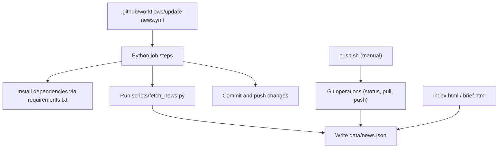
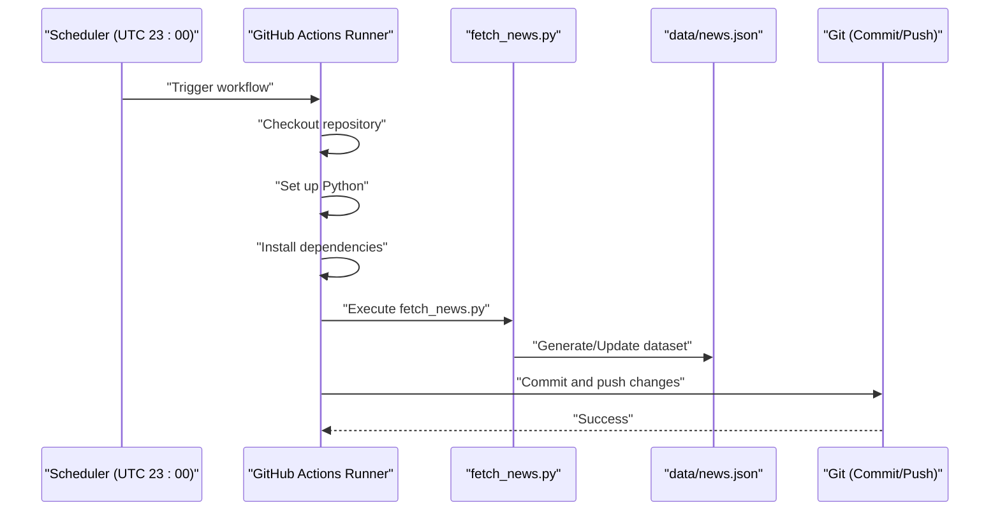
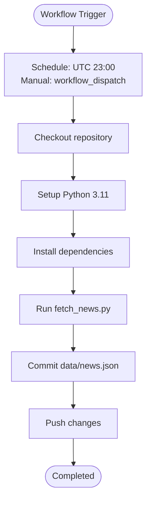
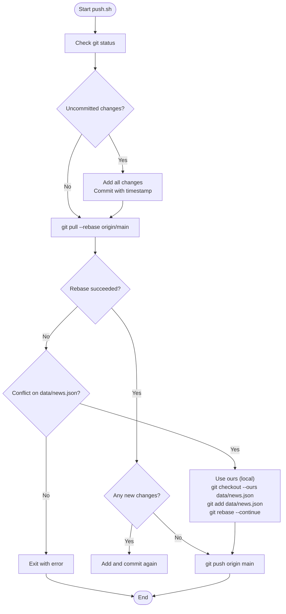
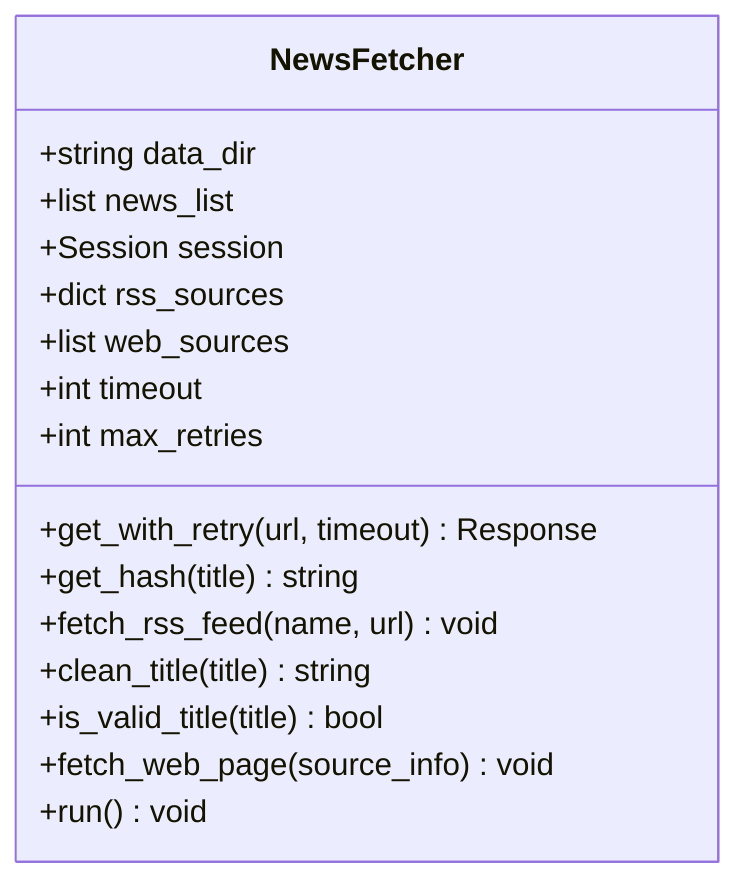
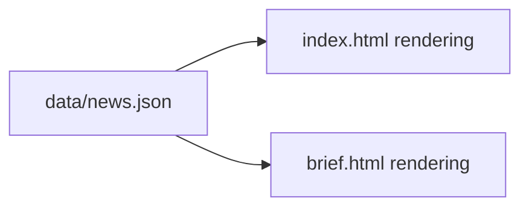
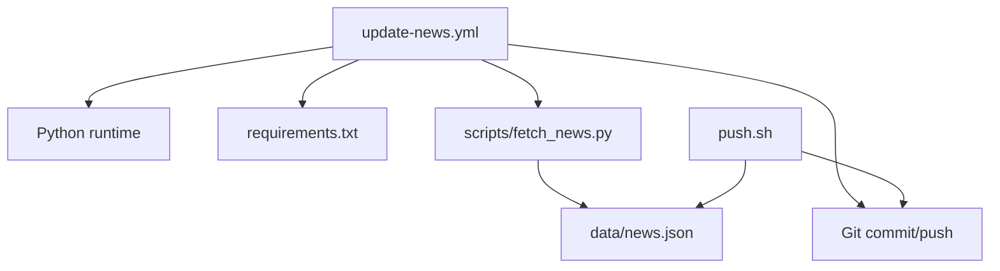

# Deployment & Automation

<cite>
**Referenced Files in This Document**
- [update-news.yml](file://.github/workflows/update-news.yml)
- [push.sh](file://push.sh)
- [fetch_news.py](file://scripts/fetch_news.py)
- [README.md](file://README.md)
- [requirements.txt](file://requirements.txt)
- [news.json](file://data/news.json)
- [index.html](file://index.html)
- [brief.html](file://brief.html)
- [test_connections.py](file://test_connections.py)
</cite>

## Table of Contents
1. [Introduction](#introduction)
2. [Project Structure](#project-structure)
3. [Core Components](#core-components)
4. [Architecture Overview](#architecture-overview)
5. [Detailed Component Analysis](#detailed-component-analysis)
6. [Dependency Analysis](#dependency-analysis)
7. [Performance Considerations](#performance-considerations)
8. [Troubleshooting Guide](#troubleshooting-guide)
9. [Conclusion](#conclusion)
10. [Appendices](#appendices)

## Introduction
This document explains the deployment and automation system for the daily news project. It covers the automated GitHub Actions workflow that runs daily to collect news, generate data, and automatically commit and push updates. It also documents the manual deployment script for local and emergency updates, GitHub Pages configuration, secrets and triggers, troubleshooting, customization, and best practices for production-grade deployments.

## Project Structure
The repository is organized around a GitHub Actions workflow, a Python news fetching script, static HTML pages, and a JSON dataset. The key elements for deployment and automation are:

- Workflow definition under .github/workflows/update-news.yml
- Manual deployment script push.sh
- News fetching logic in scripts/fetch_news.py
- Static pages index.html and brief.html
- Dataset data/news.json
- Dependencies in requirements.txt
- Project documentation in README.md

**Diagram sources**
- [update-news.yml:1-38](file://.github/workflows/update-news.yml#L1-L38)
- [requirements.txt:1-4](file://requirements.txt#L1-L4)
- [fetch_news.py:1-2222](file://scripts/fetch_news.py#L1-L2222)
- [news.json:1-200](file://data/news.json#L1-L200)
- [index.html:1-200](file://index.html#L1-L200)
- [brief.html:1-200](file://brief.html#L1-L200)
- [push.sh:1-60](file://push.sh#L1-L60)

**Section sources**
- [README.md:30-47](file://README.md#L30-L47)
- [update-news.yml:1-38](file://.github/workflows/update-news.yml#L1-L38)
- [requirements.txt:1-4](file://requirements.txt#L1-L4)
- [fetch_news.py:1-2222](file://scripts/fetch_news.py#L1-L2222)
- [news.json:1-200](file://data/news.json#L1-L200)
- [index.html:1-200](file://index.html#L1-L200)
- [brief.html:1-200](file://brief.html#L1-L200)
- [push.sh:1-60](file://push.sh#L1-L60)

## Core Components
- Automated workflow: A scheduled GitHub Actions job that checks out the repo, sets up Python, installs dependencies, runs the news fetcher, and commits/pushes changes.
- Manual deployment script: A Bash script that checks Git status, pulls remote changes with rebase, resolves conflicts for the news dataset, and pushes updates.
- News fetcher: A Python module that scrapes and aggregates news, writes structured data to data/news.json.
- Static pages: HTML pages that render the latest dataset from data/news.json.
- Dependencies: Python packages required for scraping and parsing.

**Section sources**
- [update-news.yml:8-38](file://.github/workflows/update-news.yml#L8-L38)
- [push.sh:1-60](file://push.sh#L1-L60)
- [fetch_news.py:12-25](file://scripts/fetch_news.py#L12-L25)
- [requirements.txt:1-4](file://requirements.txt#L1-L4)
- [news.json:1-200](file://data/news.json#L1-L200)
- [index.html:1-200](file://index.html#L1-L200)
- [brief.html:1-200](file://brief.html#L1-L200)

## Architecture Overview
The deployment pipeline consists of two primary paths:
- Automated path: GitHub Actions schedules a daily run, executes the Python script, and commits/pushes changes.
- Manual path: A developer runs push.sh locally to sync, resolve conflicts, and push updates.

**Diagram sources**
- [update-news.yml:3-38](file://.github/workflows/update-news.yml#L3-L38)
- [fetch_news.py:1-2222](file://scripts/fetch_news.py#L1-L2222)
- [news.json:1-200](file://data/news.json#L1-L200)

## Detailed Component Analysis

### Automated Workflow (.github/workflows/update-news.yml)
- Triggers: Scheduled at UTC 23:00 and supports manual dispatch.
- Steps:
  - Checkout repository with credentials persistence.
  - Set up Python 3.11.
  - Install pip and dependencies from requirements.txt.
  - Run the news fetching script.
  - Commit and push changes with a generated message, targeting data/news.json.

**Diagram sources**
- [update-news.yml:3-38](file://.github/workflows/update-news.yml#L3-L38)

**Section sources**
- [update-news.yml:1-38](file://.github/workflows/update-news.yml#L1-L38)
- [README.md:37-46](file://README.md#L37-L46)

### Manual Deployment Script (push.sh)
- Purpose: Local/emergency deployment to synchronize with remote, handle conflicts for the news dataset, and push changes.
- Highlights:
  - Checks Git status and commits staged changes if present.
  - Pulls remote changes with rebase.
  - Detects unmerged conflict for data/news.json and resolves it by keeping the local version.
  - Re-adds the resolved file and continues the rebase.
  - Commits and pushes to origin/main.

**Diagram sources**
- [push.sh:1-60](file://push.sh#L1-L60)

**Section sources**
- [push.sh:1-60](file://push.sh#L1-L60)

### News Fetcher (scripts/fetch_news.py)
- Responsibilities:
  - Initializes data directory and session.
  - Defines RSS and web sources.
  - Implements retry logic and robust parsing.
  - Filters titles and cleans content.
  - Writes aggregated news to data/news.json with metadata and computed scores.
- Data model: The script writes a JSON structure containing update_time, total_count, sources, and a news array with fields such as id, title, source, url, publish_time, views, comments, forwards, favorites, content, and hotness.

**Diagram sources**
- [fetch_news.py:12-25](file://scripts/fetch_news.py#L12-L25)
- [fetch_news.py:69-191](file://scripts/fetch_news.py#L69-L191)

**Section sources**
- [fetch_news.py:12-25](file://scripts/fetch_news.py#L12-L25)
- [fetch_news.py:69-191](file://scripts/fetch_news.py#L69-L191)
- [news.json:1-200](file://data/news.json#L1-L200)

### Static Pages Rendering (index.html, brief.html)
- Both pages load data/news.json to render the latest news.
- index.html displays a ranked list with sorting controls and statistics.
- brief.html presents a curated layout suitable for researchers.

**Diagram sources**
- [news.json:1-200](file://data/news.json#L1-L200)
- [index.html:1-200](file://index.html#L1-L200)
- [brief.html:1-200](file://brief.html#L1-L200)

**Section sources**
- [index.html:1-200](file://index.html#L1-L200)
- [brief.html:1-200](file://brief.html#L1-L200)
- [news.json:1-200](file://data/news.json#L1-L200)

## Dependency Analysis
- Workflow depends on:
  - Python runtime and dependencies installed from requirements.txt.
  - scripts/fetch_news.py to produce data/news.json.
  - Git operations to commit and push changes.
- Manual script depends on:
  - Git CLI and SSH access to the remote repository.
  - Local presence of data/news.json to resolve conflicts.

**Diagram sources**
- [update-news.yml:18-38](file://.github/workflows/update-news.yml#L18-L38)
- [requirements.txt:1-4](file://requirements.txt#L1-L4)
- [fetch_news.py:1-2222](file://scripts/fetch_news.py#L1-L2222)
- [news.json:1-200](file://data/news.json#L1-L200)
- [push.sh:1-60](file://push.sh#L1-L60)

**Section sources**
- [update-news.yml:18-38](file://.github/workflows/update-news.yml#L18-L38)
- [requirements.txt:1-4](file://requirements.txt#L1-L4)
- [fetch_news.py:1-2222](file://scripts/fetch_news.py#L1-L2222)
- [news.json:1-200](file://data/news.json#L1-L200)
- [push.sh:1-60](file://push.sh#L1-L60)

## Performance Considerations
- Network resilience: The fetcher retries failed HTTP requests and parses multiple time formats to improve reliability.
- Data volume: The dataset is written to a single JSON file; consider pagination or incremental updates if growth becomes significant.
- Build time: The workflow installs dependencies each run; caching could reduce latency if the dependency set stabilizes.
- Concurrency: The scheduler runs once daily; avoid overlapping jobs to prevent resource contention.

[No sources needed since this section provides general guidance]

## Troubleshooting Guide
Common issues and resolutions:

- Workflow fails to install dependencies
  - Verify Python version compatibility and network connectivity.
  - Confirm requirements.txt is present and correct.
  - Check action logs for pip errors.

- Workflow cannot commit/push
  - Ensure credentials are persisted during checkout.
  - Confirm write permissions for the repository and branch protection rules.

- Manual push conflicts on data/news.json
  - The script detects unmerged data/news.json and resolves by keeping the local version; review changes afterward.
  - If conflicts involve other files, resolve manually and retry.

- Data not updating in pages
  - Confirm data/news.json is generated and committed by the workflow or script.
  - Validate that index.html and brief.html load the dataset correctly.

- External site connectivity issues
  - Use test_connections.py to probe target sites and adjust headers if needed.

**Section sources**
- [update-news.yml:13-38](file://.github/workflows/update-news.yml#L13-L38)
- [push.sh:27-41](file://push.sh#L27-L41)
- [test_connections.py:1-45](file://test_connections.py#L1-L45)

## Conclusion
The deployment and automation system combines a reliable GitHub Actions workflow with a practical manual script to keep the news dataset fresh and the pages updated. By following the configuration and troubleshooting guidance here, teams can maintain a stable, observable, and customizable deployment pipeline.

[No sources needed since this section summarizes without analyzing specific files]

## Appendices

### A. GitHub Pages Configuration
- Branch and directory:
  - Choose gh-pages branch or main branch with root (/) directory for GitHub Pages.
- Domain settings:
  - Configure a custom domain in GitHub Pages Settings if desired.
- Secrets:
  - No repository secrets are required by the current workflow; configure only if you need private tokens for external APIs.

**Section sources**
- [README.md:30-36](file://README.md#L30-L36)

### B. Setting Up GitHub Actions Secrets
- Navigate to repository Settings > Secrets and variables > Actions.
- Add any required secrets (for example, API keys) referenced by the workflow or scripts.
- Reference secrets in the workflow using the standard GitHub Actions secret syntax.

**Section sources**
- [README.md:35](file://README.md#L35)

### C. Configuring Webhook Triggers
- The repository does not define a webhook trigger in the workflow.
- To add a webhook trigger, define a webhook endpoint and integrate it with the workflow dispatch event or a CI/CD platform as needed.

**Section sources**
- [update-news.yml:6](file://.github/workflows/update-news.yml#L6)

### D. Customizing the Automation Schedule
- Modify the cron expression in the workflow to change the daily run time.
- Example: To run at 00:00 UTC, change the cron line accordingly.

**Section sources**
- [update-news.yml:4-5](file://.github/workflows/update-news.yml#L4-L5)

### E. Adding Additional Deployment Targets
- Extend the workflow to deploy to other hosting platforms by adding steps to upload artifacts or push to alternate branches.
- For GitHub Pages, ensure the Pages source matches the chosen branch and directory.

**Section sources**
- [README.md:30-36](file://README.md#L30-L36)

### F. Rollback Procedures
- Use Git history to revert problematic commits and redeploy.
- For manual rollbacks, switch to the previous commit and force-push if necessary.

**Section sources**
- [push.sh:55-57](file://push.sh#L55-L57)

### G. Best Practices for Production Deployments
- Keep dependencies pinned and monitored.
- Add notifications or checks to monitor workflow success.
- Validate dataset integrity before committing.
- Prefer minimal, atomic commits for easier rollbacks.

[No sources needed since this section provides general guidance]