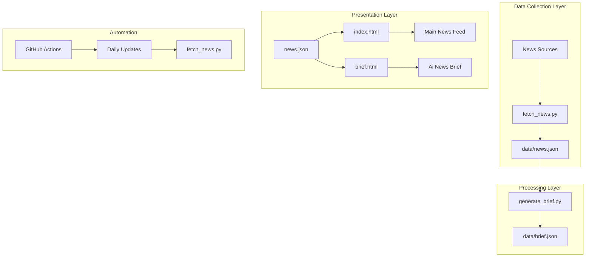

# Integration Guide

<cite>
**Referenced Files in This Document**
- [README.md](file://README.md)
- [index.html](file://index.html)
- [brief.html](file://brief.html)
- [data/news.json](file://data/news.json)
- [.github/workflows/update-news.yml](file://.github/workflows/update-news.yml)
- [requirements.txt](file://requirements.txt)
- [scripts/fetch_news.py](file://scripts/fetch_news.py)
- [scripts/generate_brief.py](file://scripts/generate_brief.py)
</cite>

## Table of Contents
1. [Introduction](#introduction)
2. [Project Structure](#project-structure)
3. [Integration Methods](#integration-methods)
4. [Technical Requirements](#technical-requirements)
5. [Embedding Techniques](#embedding-techniques)
6. [CSS Customization](#css-customization)
7. [JavaScript Integration Patterns](#javascript-integration-patterns)
8. [API Usage Patterns](#api-usage-patterns)
9. [Third-Party Integrations](#third-party-integrations)
10. [Customization Guidelines](#customization-guidelines)
11. [Troubleshooting Guide](#troubleshooting-guide)
12. [Performance Optimization](#performance-optimization)
13. [Conclusion](#conclusion)

## Introduction

The Daily News system is an automated news aggregation platform that collects and displays trending news from multiple sources including Hacker News, Reddit, and various Chinese news outlets. The system automatically updates daily via GitHub Actions and provides both a main news feed interface and an AI-powered news brief feature designed specifically for researchers and professionals.

The platform offers three primary integration methods for incorporating news feeds into existing websites and applications: standalone page deployment, iframe embedding, and subdirectory integration. Each method provides different levels of customization and technical requirements to accommodate various website architectures and design systems.

## Project Structure

The Daily News system follows a modular architecture with clear separation between data collection, processing, and presentation layers:



**Diagram sources**
- [scripts/fetch_news.py:12-85](file://scripts/fetch_news.py#L12-L85)
- [scripts/generate_brief.py:27-54](file://scripts/generate_brief.py#L27-L54)
- [.github/workflows/update-news.yml:1-38](file://.github/workflows/update-news.yml#L1-L38)

**Section sources**
- [README.md:48-62](file://README.md#L48-L62)
- [scripts/fetch_news.py:12-85](file://scripts/fetch_news.py#L12-L85)

## Integration Methods

The Daily News system supports three primary integration approaches, each suited for different use cases and technical requirements:

### Method 1: Standalone Page Deployment (Recommended)

This approach involves deploying the entire news system as a separate page within your website. It provides the simplest integration with minimal customization requirements while maintaining full functionality.

**Implementation Steps:**
1. Deploy the complete project to your hosting service
2. Configure your web server to serve the index.html as a dedicated news page
3. Link to this page from your main navigation
4. Customize the CSS to match your brand colors and typography

**Advantages:**
- Complete functionality preserved
- Minimal JavaScript integration required
- Easy maintenance and updates
- SEO-friendly single-page application

**Disadvantages:**
- Requires separate URL structure
- Limited deep integration with existing pages

### Method 2: Iframe Embedding

Iframe embedding allows seamless integration of the news feed directly into existing web pages without requiring separate URLs or complex routing.

**Implementation Steps:**
1. Host the news system on your preferred domain
2. Create an iframe element pointing to your news page
3. Configure responsive sizing and styling
4. Implement cross-origin communication if needed

**Advantages:**
- Seamless integration into existing layouts
- No URL restructuring required
- Easy to implement and modify
- Maintains separation between news and main content

**Disadvantages:**
- Limited styling control from parent page
- Potential security restrictions
- SEO considerations for embedded content

### Method 3: Subdirectory Integration

This method involves integrating the news system as a subdirectory within your existing website structure, allowing for deep integration while maintaining separate codebases.

**Implementation Steps:**
1. Create a dedicated subdirectory (e.g., `/news/`)
2. Copy all project files into this directory
3. Update relative paths in HTML files
4. Configure your web server for proper routing
5. Implement custom CSS overrides

**Advantages:**
- Deep integration with existing site architecture
- Full customization capabilities
- Maintains logical content organization
- Supports custom routing and navigation

**Disadvantages:**
- Requires careful path management
- More complex deployment process
- Potential conflicts with existing styles

**Section sources**
- [README.md:64-77](file://README.md#L64-L77)

## Technical Requirements

### System Dependencies

The Daily News system requires the following technical infrastructure:

**Python Environment:**
- Python 3.11 or higher
- Required packages: requests, beautifulsoup4, lxml
- GitHub Actions for automated updates

**Web Infrastructure:**
- Static file hosting capable of serving HTML, CSS, and JavaScript
- JSON file serving for data endpoints
- CORS configuration if embedding cross-origin

**Development Dependencies:**
- BeautifulSoup4 for HTML parsing
- Requests library for HTTP operations
- lxml parser for efficient XML/HTML processing

### Browser Compatibility

The system is designed for modern browsers with full support for:
- ES6 JavaScript features
- Modern CSS3 properties
- Fetch API for data loading
- Responsive design capabilities

**Section sources**
- [requirements.txt:1-4](file://requirements.txt#L1-L4)
- [.github/workflows/update-news.yml:18-26](file://.github/workflows/update-news.yml#L18-L26)

## Embedding Techniques

### Iframe Integration Pattern

The iframe embedding approach provides the most straightforward integration method for existing websites:

```html
<!-- Basic iframe embed -->
<iframe 
    src="https://your-domain.com/news/index.html" 
    width="100%" 
    height="600px"
    frameborder="0"
    scrolling="auto"
    sandbox="allow-scripts allow-same-origin">
</iframe>
```

**Responsive Iframe Implementation:**
```html
<div class="news-embed-container">
    <iframe 
        src="https://your-domain.com/news/index.html"
        class="responsive-news-iframe"
        onload="resizeIframe(this)">
    </iframe>
</div>

<script>
function resizeIframe(iframe) {
    iframe.style.height = iframe.contentWindow.document.body.scrollHeight + 'px';
}
</script>
```

### Standalone Page Integration

For standalone deployment, implement the following HTML structure:

```html
<!DOCTYPE html>
<html>
<head>
    <title>Your News Page</title>
    <meta charset="UTF-8">
    <meta name="viewport" content="width=device-width, initial-scale=1.0">
</head>
<body>
    <!-- Load the news system -->
    <script src="https://your-domain.com/news/index.html"></script>
</body>
</html>
```

### Subdirectory Integration

When integrating as a subdirectory, ensure proper path resolution:

```html
<!-- Correct path resolution for subdirectory -->
<link rel="stylesheet" href="/news/css/styles.css">
<script src="/news/js/main.js"></script>
```

**Section sources**
- [index.html:277-416](file://index.html#L277-L416)
- [brief.html:372-768](file://brief.html#L372-L768)

## CSS Customization

### Theme Integration Patterns

The news system provides extensive CSS customization options to match existing website themes:

**Color Scheme Customization:**
```css
/* Override default color scheme */
:root {
    --primary-color: #your-brand-blue;
    --secondary-color: #your-brand-purple;
    --accent-color: #your-brand-green;
    --background-color: #your-dark-gray;
    --text-color: #your-light-text;
}

/* Apply to news components */
.news-item {
    background: var(--background-color);
    color: var(--text-color);
}

.news-item:hover {
    border-color: var(--primary-color);
}
```

**Typography Integration:**
```css
/* Match existing font families */
.news-title {
    font-family: 'Your-Primary-Font', -apple-system, BlinkMacSystemFont, 'Segoe UI', sans-serif;
}

.news-meta, .news-stats {
    font-family: 'Your-Secondary-Font', -apple-system, BlinkMacSystemFont, 'Segoe UI', sans-serif;
}
```

**Layout Adaptation:**
```css
/* Mobile-first responsive design */
@media (max-width: 768px) {
    .news-item {
        padding: 15px;
        margin: 10px;
    }
    
    .news-title {
        font-size: 1.1em;
    }
}

/* Desktop optimization */
@media (min-width: 1024px) {
    .container {
        max-width: 1200px;
    }
    
    .news-list {
        grid-template-columns: repeat(auto-fill, minmax(500px, 1fr));
    }
}
```

### Branding Customization

**Logo Integration:**
```css
/* Replace default header styling */
header {
    background: linear-gradient(135deg, var(--primary-color), var(--secondary-color));
    /* Remove default gradient background */
}

header h1 {
    color: white;
    font-weight: 700;
}
```

**Button Theming:**
```css
/* Custom button styles */
button {
    background: var(--primary-color);
    color: white;
    border: 2px solid var(--primary-color);
    transition: all 0.3s ease;
}

button:hover {
    background: transparent;
    color: var(--primary-color);
}

button.active {
    background: var(--accent-color);
    color: white;
}
```

**Section sources**
- [index.html:7-243](file://index.html#L7-L243)
- [brief.html:7-346](file://brief.html#L7-L346)

## JavaScript Integration Patterns

### Dynamic Data Loading

The news system supports dynamic data loading patterns for custom implementations:

```javascript
// Custom news loader
class CustomNewsLoader {
    constructor(baseUrl = '/news') {
        this.baseUrl = baseUrl;
        this.newsData = [];
        this.currentSort = 'hotness';
        this.currentView = 'top';
    }
    
    async loadNewsData() {
        try {
            const response = await fetch(`${this.baseUrl}/data/news.json`);
            if (!response.ok) throw new Error('Failed to load data');
            const data = await response.json();
            this.newsData = data.news;
            return this.renderNews();
        } catch (error) {
            console.error('Error loading news data:', error);
            return this.showError();
        }
    }
    
    renderNews() {
        // Custom rendering logic here
        const sorted = [...this.newsData].sort((a, b) => 
            b[this.currentSort] - a[this.currentSort]
        );
        
        // Implement custom display logic
        return this.customRender(sorted);
    }
}
```

### Event-Driven Integration

For interactive websites, implement event-driven news updates:

```javascript
// Event listener for news updates
document.addEventListener('newsUpdated', (event) => {
    const newsItems = event.detail.items;
    const container = document.getElementById('news-feed');
    
    // Update custom news display
    container.innerHTML = this.generateCustomHTML(newsItems);
});

// Custom news item click handler
document.addEventListener('newsItemClick', (event) => {
    const newsItem = event.detail.item;
    // Handle custom action (e.g., modal display, custom sharing)
    this.showCustomModal(newsItem);
});
```

### API Endpoint Integration

Direct API integration for custom news displays:

```javascript
// Custom API client
class NewsApiClient {
    constructor(apiUrl = '/news/data') {
        this.apiUrl = apiUrl;
    }
    
    async getTopNews(limit = 20) {
        try {
            const response = await fetch(`${this.apiUrl}/news.json`);
            const data = await response.json();
            
            return data.news
                .sort((a, b) => b.hotness - a.hotness)
                .slice(0, limit);
        } catch (error) {
            console.error('API Error:', error);
            return [];
        }
    }
    
    async getNewsByCategory(category, limit = 10) {
        const news = await this.getTopNews();
        return news.filter(item => 
            item.title.toLowerCase().includes(category.toLowerCase())
        ).slice(0, limit);
    }
}
```

**Section sources**
- [index.html:277-416](file://index.html#L277-L416)
- [brief.html:372-768](file://brief.html#L372-L768)

## API Usage Patterns

### JSON Data Endpoint

The system exposes a structured JSON endpoint containing all news data:

**Endpoint:** `/data/news.json`

**Response Structure:**
```json
{
  "update_time": "2026-04-07T15:30:30.478647",
  "total_count": 91,
  "sources": 40,
  "news": [
    {
      "id": "unique_md5_hash",
      "title": "News headline text",
      "source": "News source name",
      "url": "Original article URL",
      "publish_time": "ISO 8601 timestamp",
      "views": 12345,
      "comments": 123,
      "forwards": 45,
      "favorites": 67,
      "content": "Article content or empty string",
      "hotness": 95.5
    }
  ]
}
```

### Data Filtering and Sorting

**Sorting Options:**
- `hotness`: Overall popularity score
- `views`: Number of views
- `comments`: Comment count
- `forwards`: Share count
- `favorites`: Bookmark count

**Filtering Examples:**
```javascript
// Filter by source
const filteredBySource = newsData.filter(item => 
    item.source === 'Specific Source'
);

// Filter by time range
const recentNews = newsData.filter(item => {
    const publishDate = new Date(item.publish_time);
    const now = new Date();
    const timeDiff = now - publishDate;
    return timeDiff <= 24 * 60 * 60 * 1000; // Last 24 hours
});

// Filter by category keywords
const technologyNews = newsData.filter(item => 
    item.title.toLowerCase().includes('technology') ||
    item.title.toLowerCase().includes('tech')
);
```

### Real-time Updates

For dynamic content, implement polling or WebSocket connections:

```javascript
// Polling implementation
class NewsPoller {
    constructor(endpoint, interval = 300000) { // 5 minutes
        this.endpoint = endpoint;
        this.interval = interval;
        this.timer = null;
    }
    
    start() {
        this.fetchNews();
        this.timer = setInterval(() => this.fetchNews(), this.interval);
    }
    
    stop() {
        if (this.timer) {
            clearInterval(this.timer);
            this.timer = null;
        }
    }
    
    async fetchNews() {
        try {
            const response = await fetch(this.endpoint);
            const data = await response.json();
            this.onNewsUpdate(data);
        } catch (error) {
            console.error('Polling error:', error);
        }
    }
    
    onNewsUpdate(data) {
        // Custom update handler
        document.dispatchEvent(new CustomEvent('newsUpdated', {
            detail: { data }
        }));
    }
}
```

**Section sources**
- [data/news.json:1-1190](file://data/news.json#L1-L1190)
- [scripts/fetch_news.py:127-147](file://scripts/fetch_news.py#L127-L147)

## Third-Party Integrations

### Social Media Sharing

The system supports multiple social media platforms for content sharing:

**Platform Integration Options:**
- **WeChat**: QR code generation and share buttons
- **Weibo**: Microblog sharing with custom hashtags
- **Twitter**: Standard tweet sharing with pre-filled text
- **LinkedIn**: Professional sharing with article metadata
- **Facebook**: Standard sharing dialog

**Implementation Example:**
```javascript
// Social media sharing function
function shareToSocialMedia(platform, newsItem) {
    const baseUrls = {
        weibo: `https://service.weibo.com/share/share.php?title=${encodeURIComponent(newsItem.title)}&url=${encodeURIComponent(newsItem.url)}`,
        twitter: `https://twitter.com/intent/tweet?text=${encodeURIComponent(newsItem.title)}&url=${encodeURIComponent(newsItem.url)}&hashtags=news,trending`,
        linkedin: `https://www.linkedin.com/sharing/share-offsite/?url=${encodeURIComponent(newsItem.url)}`
    };
    
    window.open(baseUrls[platform], '_blank', 'width=600,height=400');
}
```

### Analytics Tracking

**Google Analytics Integration:**
```javascript
// Track news clicks
function trackNewsClick(newsId, title) {
    if (typeof gtag !== 'undefined') {
        gtag('event', 'news_click', {
            event_category: 'engagement',
            event_label: `${newsId}:${title}`,
            value: 1
        });
    }
}

// Track sorting changes
function trackSortingChange(sortType) {
    if (typeof gtag !== 'undefined') {
        gtag('event', 'news_sort_change', {
            event_category: 'navigation',
            event_label: sortType
        });
    }
}
```

**Matomo/Piwik Integration:**
```javascript
// Matomo tracking
function trackWithMatomo(action, category, name, value) {
    if (typeof _paq !== 'undefined') {
        _paq.push(['trackEvent', category, action, name, value]);
    }
}
```

### Content Syndication

**RSS Feed Generation:**
```javascript
// Generate RSS feed for external syndication
function generateRSSFeed(newsData) {
    const rss = `<?xml version="1.0" encoding="UTF-8"?>
    <rss version="2.0">
        <channel>
            <title>Daily News Feed</title>
            <description>Automated news aggregation</description>
            <link>https://your-domain.com/news</link>
            <lastBuildDate>${new Date().toUTCString()}</lastBuildDate>
            
            ${newsData.news.slice(0, 50).map(item => `
            <item>
                <title>${escapeXml(item.title)}</title>
                <description>${escapeXml(item.content || item.title)}</description>
                <link>${escapeXml(item.url)}</link>
                <pubDate>${new Date(item.publish_time).toUTCString()}</pubDate>
                <source url="${escapeXml(item.source)}">${escapeXml(item.source)}</source>
            </item>
            `).join('')}
        </channel>
    </rss>`;
    
    return rss;
}
```

**Section sources**
- [index.html:397-413](file://index.html#L397-L413)
- [brief.html:401-405](file://brief.html#L401-L405)

## Customization Guidelines

### Design System Integration

**Component-Level Customization:**
```css
/* Override individual components */
.news-item {
    border-radius: var(--custom-border-radius, 8px);
    box-shadow: var(--custom-shadow, 0 2px 10px rgba(0,0,0,0.1));
    transition: var(--custom-transition, all 0.3s ease);
}

.news-title {
    font-weight: var(--custom-font-weight, 600);
    color: var(--custom-text-color, #1a1a1a);
}

.rank-badge {
    width: var(--custom-badge-size, 30px);
    height: var(--custom-badge-size, 30px);
    font-size: var(--custom-badge-font-size, 0.9em);
}
```

**Layout Flexibility:**
```css
/* Grid-based layout for responsive design */
.news-list {
    display: grid;
    grid-template-columns: repeat(auto-fill, minmax(300px, 1fr));
    gap: var(--custom-gap, 20px);
    padding: var(--custom-padding, 20px);
}

/* Single column for mobile */
@media (max-width: 768px) {
    .news-list {
        grid-template-columns: 1fr;
        gap: var(--mobile-gap, 15px);
    }
}
```

### Content Personalization

**User Profile Integration:**
```javascript
// User preference-based filtering
class PersonalizedNewsFeed {
    constructor(userProfile) {
        this.userProfile = userProfile;
        this.interests = userProfile.interests || [];
        this.preferences = userProfile.preferences || {};
    }
    
    filterNews(newsData) {
        return newsData.filter(item => 
            this.shouldDisplayItem(item, this.userProfile)
        );
    }
    
    shouldDisplayItem(item, profile) {
        const title = item.title.toLowerCase();
        
        // Check against user interests
        return profile.interests.some(interest => 
            title.includes(interest.toLowerCase())
        );
    }
}
```

**Dynamic Content Adaptation:**
```javascript
// Adapt content based on user context
function adaptContentForContext(newsItem, context) {
    const adaptations = {
        mobile: {
            truncateTitle: true,
            reduceStats: true,
            simplifiedLayout: true
        },
        desktop: {
            fullDetails: true,
            expandedStats: true,
            richLayout: true
        },
        darkMode: {
            highContrastColors: true,
            reducedBrightness: true
        }
    };
    
    return { ...newsItem, ...adaptations[context] };
}
```

### Accessibility Compliance

**WCAG 2.1 AA Compliance:**
```css
/* Enhanced accessibility styling */
.accessible-news-item {
    border: 2px solid transparent;
    outline: 2px solid transparent;
    transition: border-color 0.2s, outline 0.2s;
}

.accessible-news-item:focus,
.accessible-news-item:focus-within {
    border-color: #005fcc;
    outline: 2px solid #005fcc;
    outline-offset: 2px;
}

/* High contrast mode support */
@media (prefers-contrast: high) {
    .news-item {
        border: 3px solid #000;
    }
    
    .news-title {
        font-weight: 700;
    }
}
```

**Section sources**
- [index.html:7-243](file://index.html#L7-L243)
- [brief.html:7-346](file://brief.html#L7-L346)

## Troubleshooting Guide

### Common Integration Issues

**Issue 1: Cross-Origin Resource Sharing (CORS) Errors**

**Symptoms:** Browser console shows CORS errors when loading news data

**Solutions:**
```javascript
// Enable CORS for your domain
fetch('/news/data/news.json', {
    method: 'GET',
    mode: 'cors',
    headers: {
        'Access-Control-Allow-Origin': '*',
        'Content-Type': 'application/json'
    }
});

// Or use proxy endpoint
async function getNewsThroughProxy() {
    const response = await fetch('/api/news', {
        method: 'GET',
        headers: {
            'X-Requested-With': 'XMLHttpRequest'
        }
    });
    return response.json();
}
```

**Issue 2: Responsive Design Breakage**

**Symptoms:** News items overlap or overflow on mobile devices

**Solutions:**
```css
/* Fix responsive issues */
@media (max-width: 768px) {
    .news-item {
        min-height: 120px;
        padding: 15px;
    }
    
    .news-title {
        font-size: 1.1em;
        line-height: 1.3;
    }
    
    .news-stats {
        flex-direction: row;
        flex-wrap: wrap;
    }
    
    .stat-item {
        flex: 1 1 45%;
        margin-bottom: 5px;
    }
}
```

**Issue 3: Performance Degradation**

**Symptoms:** Slow loading times or browser freezing

**Solutions:**
```javascript
// Implement lazy loading
class LazyNewsLoader {
    constructor(container, batchSize = 10) {
        this.container = container;
        this.batchSize = batchSize;
        this.loadedCount = 0;
        this.newsItems = [];
    }
    
    loadBatch() {
        const batch = this.newsItems.slice(
            this.loadedCount, 
            this.loadedCount + this.batchSize
        );
        
        this.renderBatch(batch);
        this.loadedCount += batch.length;
        
        // Continue loading if more items exist
        if (this.loadedCount < this.newsItems.length) {
            setTimeout(() => this.loadBatch(), 100);
        }
    }
    
    renderBatch(batch) {
        const fragment = document.createDocumentFragment();
        batch.forEach(item => {
            fragment.appendChild(this.createNewsElement(item));
        });
        this.container.appendChild(fragment);
    }
}
```

**Issue 4: Data Loading Failures**

**Symptoms:** News items fail to load or show error messages

**Solutions:**
```javascript
// Implement robust error handling
class RobustNewsLoader {
    constructor(maxRetries = 3) {
        this.maxRetries = maxRetries;
        this.retryDelay = 1000;
    }
    
    async loadNewsWithRetry(url, retryCount = 0) {
        try {
            const response = await fetch(url, {
                cache: 'no-cache',
                headers: {
                    'Cache-Control': 'no-cache'
                }
            });
            
            if (!response.ok) {
                throw new Error(`HTTP ${response.status}`);
            }
            
            return await response.json();
        } catch (error) {
            if (retryCount < this.maxRetries) {
                await this.delay(this.retryDelay * Math.pow(2, retryCount));
                return this.loadNewsWithRetry(url, retryCount + 1);
            }
            throw error;
        }
    }
    
    delay(ms) {
        return new Promise(resolve => setTimeout(resolve, ms));
    }
}
```

### Debugging Tools

**Console Logging:**
```javascript
// Enable debug logging
class DebugNewsLoader {
    constructor(debug = false) {
        this.debug = debug;
    }
    
    log(message, ...args) {
        if (this.debug) {
            console.log('[News Loader]', message, ...args);
        }
    }
    
    warn(message, ...args) {
        if (this.debug) {
            console.warn('[News Loader]', message, ...args);
        }
    }
    
    error(message, ...args) {
        if (this.debug) {
            console.error('[News Loader]', message, ...args);
        }
    }
}
```

**Network Monitoring:**
```javascript
// Monitor network requests
function monitorNewsRequests() {
    const originalFetch = window.fetch;
    
    window.fetch = function(...args) {
        const startTime = Date.now();
        
        return originalFetch.apply(this, args).then(response => {
            const endTime = Date.now();
            console.log(`News API Request: ${endTime - startTime}ms`);
            return response;
        }).catch(error => {
            console.error('News API Error:', error);
            throw error;
        });
    };
}
```

**Section sources**
- [index.html:282-295](file://index.html#L282-L295)
- [brief.html:381-399](file://brief.html#L381-L399)

## Performance Optimization

### Loading Strategies

**Optimized Data Loading:**
```javascript
// Implement efficient data loading
class OptimizedNewsLoader {
    constructor(options = {}) {
        this.cache = new Map();
        this.cacheTimeout = options.cacheTimeout || 300000; // 5 minutes
        this.batchSize = options.batchSize || 20;
    }
    
    async getCachedNews() {
        const now = Date.now();
        
        // Check cache validity
        if (this.cache.has('news') && 
            now - this.cache.get('timestamp') < this.cacheTimeout) {
            return this.cache.get('news');
        }
        
        // Fetch fresh data
        const newsData = await this.fetchFreshNews();
        this.cache.set('news', newsData);
        this.cache.set('timestamp', now);
        
        return newsData;
    }
    
    async fetchFreshNews() {
        const response = await fetch('/news/data/news.json', {
            cache: 'no-store',
            headers: {
                'Cache-Control': 'no-cache'
            }
        });
        
        if (!response.ok) {
            throw new Error(`Failed to fetch news: ${response.status}`);
        }
        
        return response.json();
    }
}
```

**Image Optimization:**
```css
/* Optimize news images */
.news-content img {
    max-width: 100%;
    height: auto;
    display: block;
    margin: 10px auto;
}

/* Lazy loading for images */
.news-content img[data-src] {
    opacity: 0;
    transition: opacity 0.3s;
}

.news-content img[data-src].loaded {
    opacity: 1;
}
```

**Code Splitting:**
```javascript
// Dynamically load news components
async function loadNewsComponent(componentName) {
    switch (componentName) {
        case 'interactive':
            return await import('./components/interactive-news.js');
        case 'brief':
            return await import('./components/news-brief.js');
        case 'analytics':
            return await import('./components/news-analytics.js');
        default:
            throw new Error(`Unknown component: ${componentName}`);
    }
}
```

### Memory Management

**Efficient DOM Manipulation:**
```javascript
// Use document fragments for bulk updates
class EfficientDOMManager {
    constructor(container) {
        this.container = container;
        this.fragment = document.createDocumentFragment();
    }
    
    addNewsItems(items) {
        items.forEach(item => {
            const element = this.createNewsElement(item);
            this.fragment.appendChild(element);
        });
        
        // Batch append to DOM
        this.container.appendChild(this.fragment);
        this.fragment = document.createDocumentFragment();
    }
    
    clearContainer() {
        this.container.innerHTML = '';
        this.fragment = document.createDocumentFragment();
    }
}
```

**Event Listener Optimization:**
```javascript
// Use event delegation
class OptimizedEventManager {
    constructor(container) {
        this.container = container;
        this.setupEventDelegation();
    }
    
    setupEventDelegation() {
        this.container.addEventListener('click', (event) => {
            const target = event.target.closest('[data-action]');
            
            if (target) {
                const action = target.dataset.action;
                const newsId = target.dataset.newsId;
                
                this.handleAction(action, newsId);
            }
        });
    }
    
    handleAction(action, newsId) {
        switch (action) {
            case 'share':
                this.shareNews(newsId);
                break;
            case 'save':
                this.saveNews(newsId);
                break;
            case 'expand':
                this.expandNews(newsId);
                break;
        }
    }
}
```

### Caching Strategies

**Browser Caching:**
```javascript
// Implement intelligent caching
class IntelligentCache {
    constructor() {
        this.memoryCache = new Map();
        this.storage = localStorage;
        this.maxSize = 100;
    }
    
    set(key, value) {
        // Memory cache for quick access
        this.memoryCache.set(key, {
            value,
            timestamp: Date.now()
        });
        
        // Persistent storage for longer retention
        try {
            this.storage.setItem(key, JSON.stringify({
                value,
                timestamp: Date.now()
            }));
        } catch (e) {
            // Storage quota exceeded
            console.warn('Storage quota exceeded');
        }
        
        // Manage cache size
        this.trimCache();
    }
    
    get(key) {
        // Check memory cache first
        const memoryItem = this.memoryCache.get(key);
        if (memoryItem && Date.now() - memoryItem.timestamp < 300000) {
            return memoryItem.value;
        }
        
        // Check persistent storage
        const storageItem = this.storage.getItem(key);
        if (storageItem) {
            const parsed = JSON.parse(storageItem);
            if (Date.now() - parsed.timestamp < 86400000) {
                // Move to memory cache
                this.memoryCache.set(key, parsed);
                return parsed.value;
            }
        }
        
        return null;
    }
    
    trimCache() {
        if (this.memoryCache.size > this.maxSize) {
            const oldestKey = this.memoryCache.keys().next().value;
            this.memoryCache.delete(oldestKey);
        }
    }
}
```

**Section sources**
- [index.html:277-416](file://index.html#L277-L416)
- [brief.html:372-768](file://brief.html#L372-L768)

## Conclusion

The Daily News system provides a comprehensive solution for integrating automated news feeds into existing websites and applications. With three distinct integration methods, extensive customization options, and robust technical architecture, it can accommodate diverse website requirements and technical constraints.

The system's strength lies in its modular design, which allows for flexible deployment strategies while maintaining full functionality. Whether you choose standalone deployment, iframe embedding, or subdirectory integration, the platform provides consistent performance and reliable data delivery.

Key advantages of the integration approach include:
- **Seamless Integration:** Minimal disruption to existing website architecture
- **Customizable Design:** Extensive CSS customization options for brand alignment
- **Robust Performance:** Optimized loading strategies and caching mechanisms
- **Future-Proof:** Automated updates via GitHub Actions ensure fresh content
- **Developer-Friendly:** Clear API patterns and comprehensive documentation

For successful implementation, organizations should carefully evaluate their technical requirements, choose the appropriate integration method, and implement the recommended customization patterns to achieve optimal user experience and brand consistency.

The system's commitment to accessibility, performance optimization, and third-party integrations ensures it can grow with evolving web standards and user expectations while maintaining reliability and ease of maintenance.