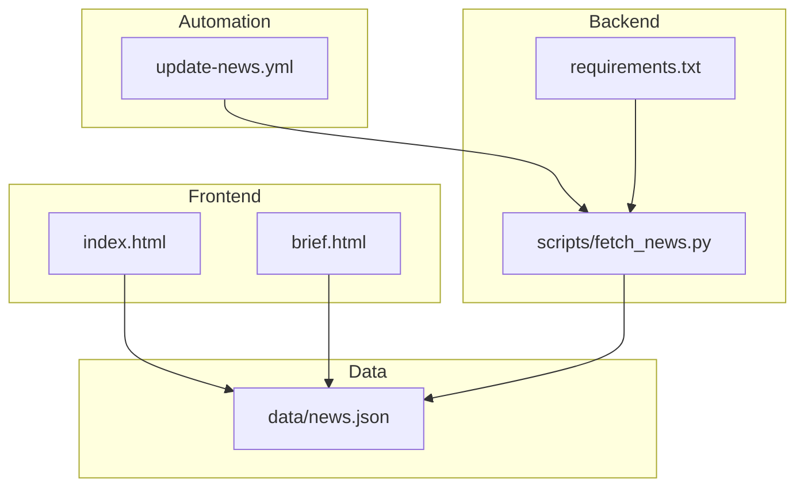
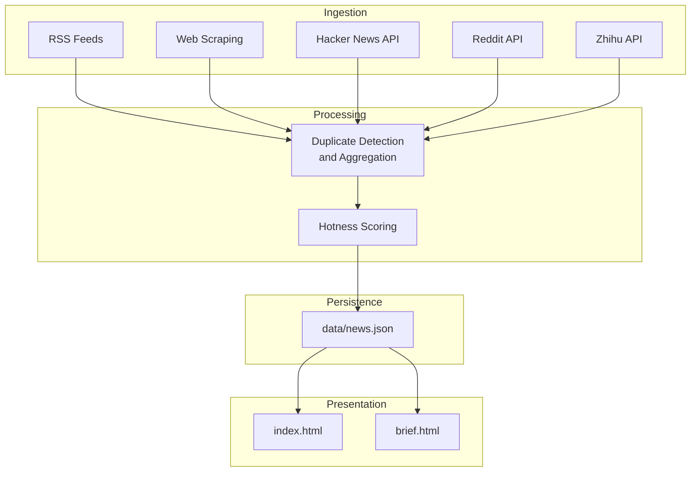
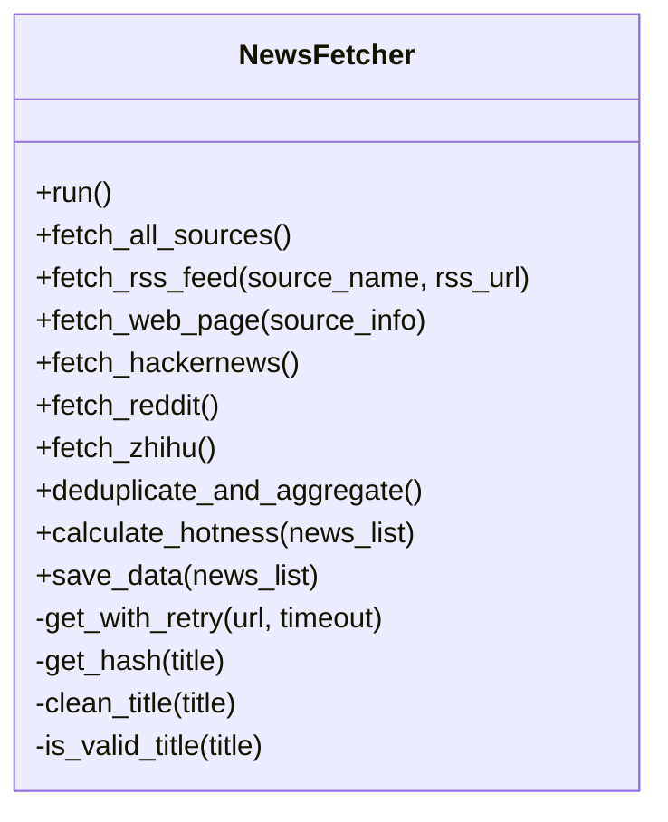
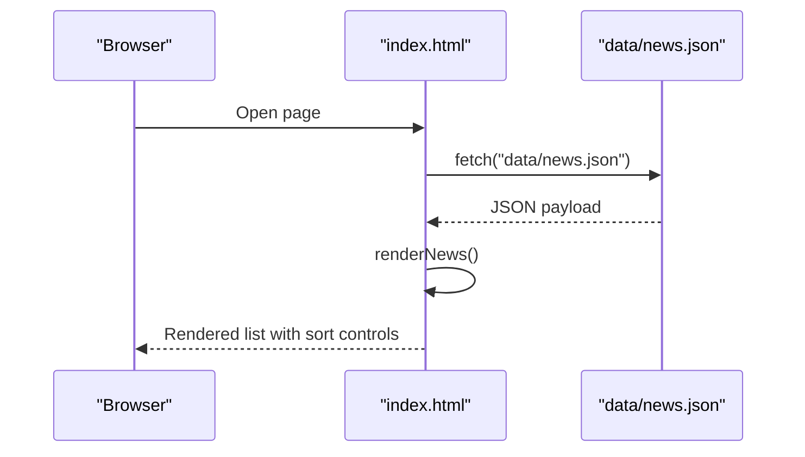
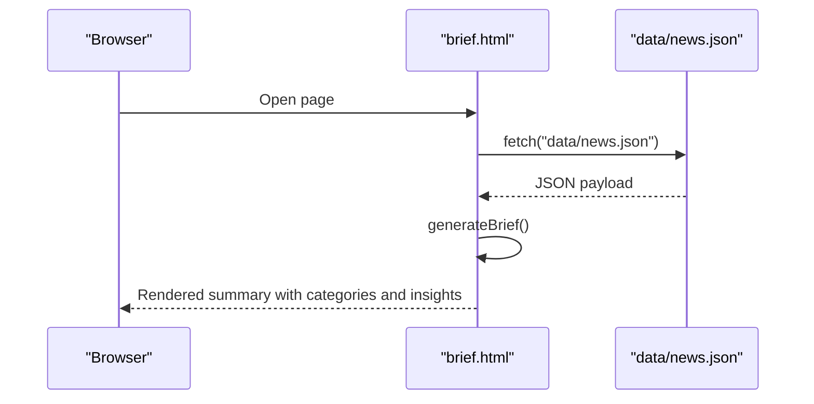
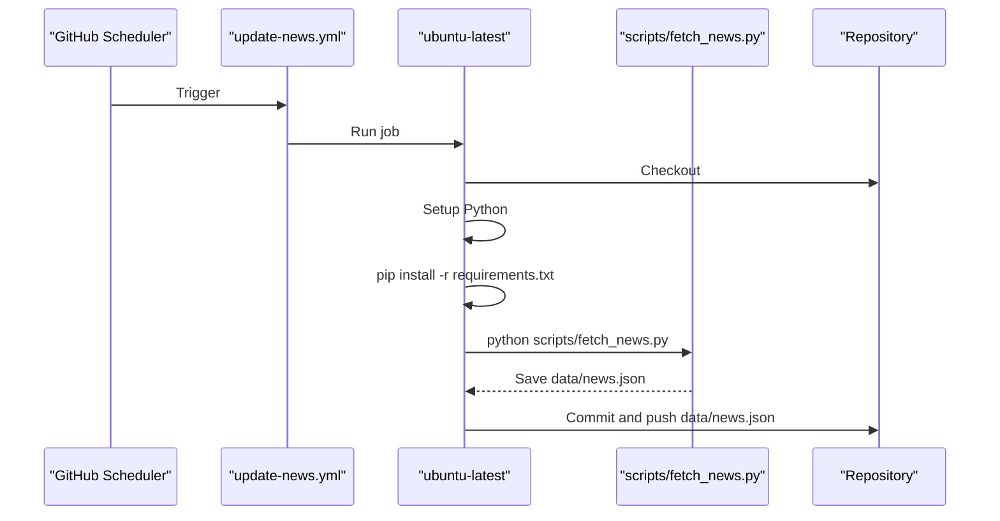
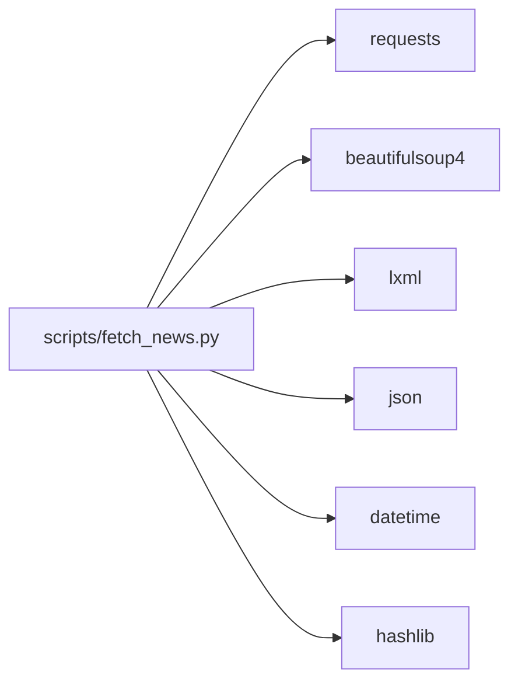

# Project Overview

<cite>
**Referenced Files in This Document**
- [README.md](file://README.md)
- [index.html](file://index.html)
- [brief.html](file://brief.html)
- [.github/workflows/update-news.yml](file://.github/workflows/update-news.yml)
- [scripts/fetch_news.py](file://scripts/fetch_news.py)
- [requirements.txt](file://requirements.txt)
- [data/news.json](file://data/news.json)
- [test_connections.py](file://test_connections.py)
</cite>

## Table of Contents
1. [Introduction](#introduction)
2. [Project Structure](#project-structure)
3. [Core Components](#core-components)
4. [Architecture Overview](#architecture-overview)
5. [Detailed Component Analysis](#detailed-component-analysis)
6. [Dependency Analysis](#dependency-analysis)
7. [Performance Considerations](#performance-considerations)
8. [Troubleshooting Guide](#troubleshooting-guide)
9. [Conclusion](#conclusion)
10. [Appendices](#appendices)

## Introduction
Daily News is a web application that automatically aggregates and displays 24-hour trending news from multiple sources. It combines a static frontend (HTML/CSS/JavaScript) with a backend Python pipeline to collect, deduplicate, score, and present aggregated news. The system is designed to be lightweight, deployable to GitHub Pages, and fully automated via GitHub Actions to refresh content daily.

Key benefits:
- Centralized view of trending topics across diverse platforms
- Automated updates to keep content fresh
- Interactive sorting and filtering for quick discovery
- Extensible architecture to add more sources

## Project Structure
The repository is organized into a small set of files that support a clear separation of concerns:
- Frontend: index.html and brief.html for rendering and presentation
- Backend: scripts/fetch_news.py orchestrates data collection, deduplication, scoring, and persistence
- Automation: .github/workflows/update-news.yml schedules daily updates
- Data: data/news.json stores the latest aggregated dataset
- Utilities: requirements.txt defines Python dependencies; test_connections.py helps diagnose connectivity issues

**Diagram sources**
- [index.html](file://index.html)
- [brief.html](file://brief.html)
- [scripts/fetch_news.py](file://scripts/fetch_news.py)
- [.github/workflows/update-news.yml](file://.github/workflows/update-news.yml)
- [data/news.json](file://data/news.json)
- [requirements.txt](file://requirements.txt)

**Section sources**
- [README.md](file://README.md)
- [index.html](file://index.html)
- [brief.html](file://brief.html)
- [.github/workflows/update-news.yml](file://.github/workflows/update-news.yml)
- [scripts/fetch_news.py](file://scripts/fetch_news.py)
- [requirements.txt](file://requirements.txt)
- [data/news.json](file://data/news.json)

## Core Components
- NewsFetcher (Python): Implements multi-source ingestion (RSS, web scraping, APIs), duplicate detection, hotness scoring, and persistence to news.json.
- Frontend pages:
  - index.html: Displays the top 20 and bottom 20 stories, sortable by multiple metrics, with expandable details.
  - brief.html: AI-powered summary tailored for researchers, grouping and analyzing top stories by category.
- GitHub Actions workflow: Runs daily to fetch, process, and commit updated news data.
- Data model: news.json contains update_time, total_count, sources, and a list of news items with fields such as id, title, source, url, publish_time, views, comments, forwards, favorites, content, and hotness.

How it works conceptually:
- The backend scrapes RSS feeds, crawls selected websites, and integrates with public APIs (e.g., Hacker News, Reddit, Zhihu).
- Duplicate detection merges entries by id and aggregates engagement metrics.
- A hotness scoring algorithm computes a composite score across multiple dimensions.
- The resulting dataset is saved to data/news.json and rendered by the frontend.

**Section sources**
- [scripts/fetch_news.py](file://scripts/fetch_news.py)
- [index.html](file://index.html)
- [brief.html](file://brief.html)
- [data/news.json](file://data/news.json)
- [.github/workflows/update-news.yml](file://.github/workflows/update-news.yml)

## Architecture Overview
The system follows a simple, robust architecture:
- Data ingestion layer: RSS feeds, web scraping, and public APIs
- Processing layer: deduplication, aggregation, and hotness scoring
- Persistence layer: news.json
- Presentation layer: static HTML pages served via GitHub Pages

**Diagram sources**
- [scripts/fetch_news.py](file://scripts/fetch_news.py)
- [index.html](file://index.html)
- [brief.html](file://brief.html)
- [data/news.json](file://data/news.json)

## Detailed Component Analysis

### Backend Pipeline: NewsFetcher
The NewsFetcher class encapsulates the entire ingestion and processing pipeline:
- Multi-source ingestion:
  - RSS feeds: fetch_rss_feed parses XML and filters items older than 24 hours.
  - Web scraping: fetch_web_page extracts titles and links, attempts to infer publish_time from meta tags and selectors, and filters invalid titles.
  - Public APIs: fetch_hackernews, fetch_reddit, fetch_zhihu integrate with platform APIs.
- Duplicate detection and aggregation: deduplicate_and_aggregate merges by id, sums engagement metrics, and retains the earliest publish_time/source/url.
- Hotness scoring: calculate_hotness computes a composite score across views, comments, forwards, and favorites, then sorts descending.
- Persistence: save_data writes update_time, total_count, sources, and the news list to data/news.json.

**Diagram sources**
- [scripts/fetch_news.py](file://scripts/fetch_news.py)

**Section sources**
- [scripts/fetch_news.py](file://scripts/fetch_news.py)

### Frontend: index.html
The main page renders the latest news from data/news.json:
- Loads news.json and displays update_time.
- Sortable by hotness, views, comments, forwards, favorites.
- View mode toggles between top 20 and bottom 20 stories.
- Click to expand details; content is shown when available.

**Diagram sources**
- [index.html](file://index.html)
- [data/news.json](file://data/news.json)

**Section sources**
- [index.html](file://index.html)
- [data/news.json](file://data/news.json)

### Frontend: brief.html
The AI-powered summary page:
- Loads the same dataset and generates categorized insights for researchers.
- Highlights top stories, trends, and actionable advice.
- Provides knowledge expansion and learning tracks.

**Diagram sources**
- [brief.html](file://brief.html)
- [data/news.json](file://data/news.json)

**Section sources**
- [brief.html](file://brief.html)
- [data/news.json](file://data/news.json)

### GitHub Actions Automation
The workflow automates the entire pipeline:
- Triggers daily at a configured time (UTC) and supports manual dispatch.
- Checks out the repository, sets up Python, installs dependencies, runs the fetch script, and commits/pushes data/news.json.

**Diagram sources**
- [.github/workflows/update-news.yml](file://.github/workflows/update-news.yml)
- [scripts/fetch_news.py](file://scripts/fetch_news.py)

**Section sources**
- [.github/workflows/update-news.yml](file://.github/workflows/update-news.yml)
- [scripts/fetch_news.py](file://scripts/fetch_news.py)

## Dependency Analysis
External dependencies are minimal and explicit:
- requests: HTTP client for API and web requests
- beautifulsoup4 + lxml: HTML/XML parsing for RSS and web scraping
- Standard library modules for datetime, hashing, and JSON

**Diagram sources**
- [scripts/fetch_news.py](file://scripts/fetch_news.py)
- [requirements.txt](file://requirements.txt)

**Section sources**
- [requirements.txt](file://requirements.txt)
- [scripts/fetch_news.py](file://scripts/fetch_news.py)

## Performance Considerations
- Network resilience: get_with_retry implements retries and backoff to handle transient failures.
- Time filtering: ingestion filters items older than 24 hours to keep the dataset fresh and manageable.
- Deduplication cost: O(n) dictionary-based merge reduces repeated entries efficiently.
- Scoring cost: Hotness scoring iterates across four dimensions and sorts once, suitable for small-to-medium datasets.
- Frontend responsiveness: Static HTML avoids server-side latency; data is loaded via a single JSON file.

[No sources needed since this section provides general guidance]

## Troubleshooting Guide
Common issues and remedies:
- Connectivity problems:
  - Use test_connections.py to probe external sites and confirm network access.
- RSS or web scraping failures:
  - Verify source URLs and selectors; adjust selectors in fetch_web_page if sites change markup.
- Hotness scoring anomalies:
  - Confirm that engagement fields (views, comments, forwards, favorites) are populated; missing values can skew scores.
- Automation not updating:
  - Check workflow logs for errors; ensure secrets and permissions are configured if needed.
- Local development:
  - Install dependencies with pip install -r requirements.txt, then run python scripts/fetch_news.py to regenerate data/news.json locally.

**Section sources**
- [test_connections.py](file://test_connections.py)
- [scripts/fetch_news.py](file://scripts/fetch_news.py)
- [.github/workflows/update-news.yml](file://.github/workflows/update-news.yml)

## Conclusion
Daily News delivers a practical, automated solution for aggregating and presenting 24-hour trending news. Its modular design—frontend HTML/CSS/JS plus a Python backend—enables easy deployment and maintenance. The GitHub Actions automation ensures timely updates, while the hotness scoring and duplicate detection provide a clean, curated dataset. The system is extensible: adding new sources involves extending the fetch_* methods and updating the data model accordingly.

[No sources needed since this section summarizes without analyzing specific files]

## Appendices

### Practical Examples
- Local run:
  - Install dependencies and run the fetcher to produce data/news.json.
- Deploy to GitHub Pages:
  - Push the repository and enable GitHub Pages on the main branch or gh-pages branch.
- Manual trigger:
  - Use the workflow_dispatch event to run the pipeline immediately.

**Section sources**
- [README.md](file://README.md)
- [.github/workflows/update-news.yml](file://.github/workflows/update-news.yml)

### Scope, Limitations, and Extensibility
- Scope:
  - Aggregates RSS feeds, web pages, and public APIs; presents top stories with hotness scoring and duplicate detection.
- Limitations:
  - Relies on external sources’ availability and stability; web scraping depends on site structure.
  - Some sources may require API keys or rate-limit handling.
- Extensibility:
  - Add new RSS feeds or web sources by extending the RSS and web source lists.
  - Integrate additional APIs by adding new fetch_* methods.
  - Adjust scoring weights or introduce new dimensions in calculate_hotness.

**Section sources**
- [scripts/fetch_news.py](file://scripts/fetch_news.py)
- [README.md](file://README.md)