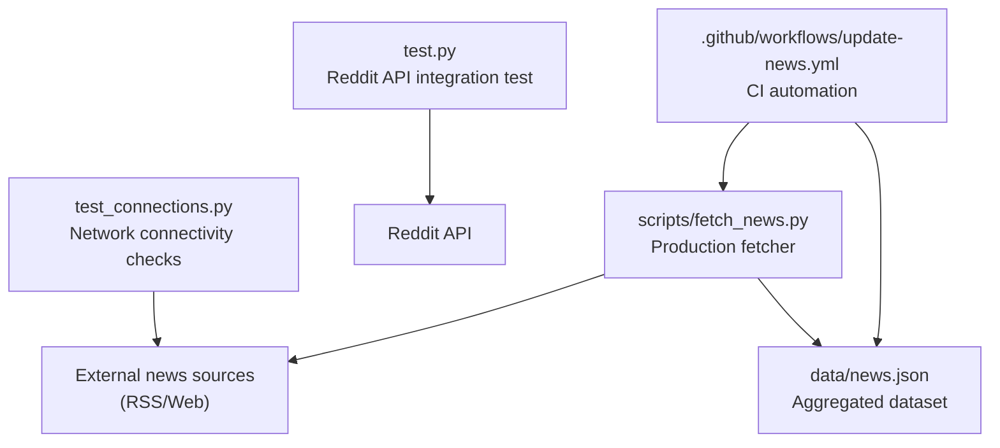
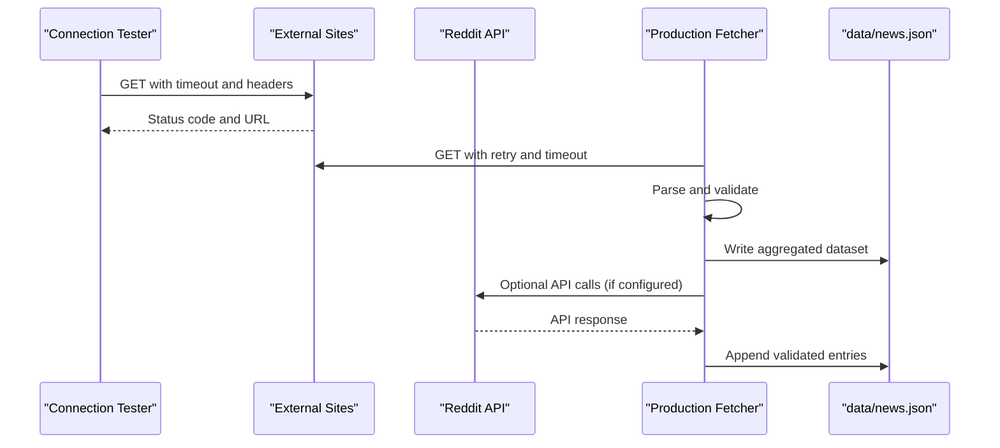
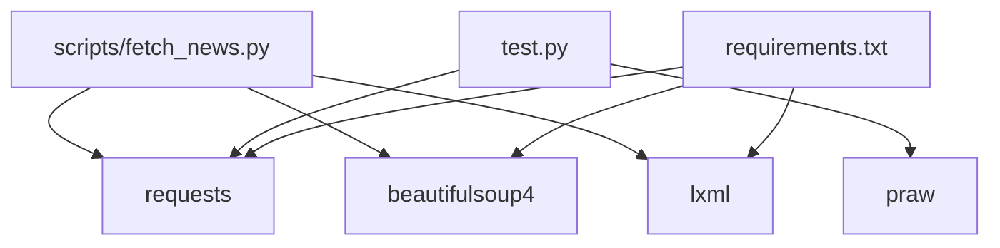

# Testing & Quality Assurance

<cite>
**Referenced Files in This Document**
- [test.py](file://test.py)
- [test_connections.py](file://test_connections.py)
- [scripts/fetch_news.py](file://scripts/fetch_news.py)
- [.github/workflows/update-news.yml](file://.github/workflows/update-news.yml)
- [requirements.txt](file://requirements.txt)
- [README.md](file://README.md)
- [data/news.json](file://data/news.json)
</cite>

## Table of Contents
1. [Introduction](#introduction)
2. [Project Structure](#project-structure)
3. [Core Components](#core-components)
4. [Architecture Overview](#architecture-overview)
5. [Detailed Component Analysis](#detailed-component-analysis)
6. [Dependency Analysis](#dependency-analysis)
7. [Performance Considerations](#performance-considerations)
8. [Troubleshooting Guide](#troubleshooting-guide)
9. [Conclusion](#conclusion)
10. [Appendices](#appendices)

## Introduction
This document focuses on testing and quality assurance for ensuring system reliability and data accuracy in the daily news aggregation pipeline. It explains:
- Connection testing utilities for validating external source connectivity and network stability
- Reddit API testing procedures for verifying API integration functionality
- Practical examples for running tests, interpreting results, and handling common failures
- Methodologies for news source validation, data integrity checks, and performance benchmarking
- Error handling and debugging strategies for failed news collection attempts, malformed data, and network timeouts
- Guidelines for writing additional tests, implementing continuous integration checks, and establishing quality gates
- Troubleshooting procedures for common testing issues and best practices for maintaining test coverage

## Project Structure
The repository organizes testing and QA-related assets as follows:
- Test utilities for external connectivity and API verification
- A production news fetcher script with robust retry, validation, and integrity safeguards
- Continuous integration workflow to automate fetching and publishing
- Data artifacts for validation and regression checks

**Diagram sources**
- [test_connections.py:1-45](file://test_connections.py#L1-L45)
- [test.py:1-49](file://test.py#L1-L49)
- [scripts/fetch_news.py:1-800](file://scripts/fetch_news.py#L1-L800)
- [.github/workflows/update-news.yml:1-38](file://.github/workflows/update-news.yml#L1-L38)
- [data/news.json:1-1190](file://data/news.json#L1-L1190)

**Section sources**
- [README.md:1-153](file://README.md#L1-L153)
- [.github/workflows/update-news.yml:1-38](file://.github/workflows/update-news.yml#L1-L38)

## Core Components
- Connection tester: Validates availability and responsiveness of major news websites and feeds
- Reddit API test: Exercises Reddit API integration and verifies data extraction
- Production fetcher: Implements resilient fetching, deduplication, validation, and integrity checks
- CI workflow: Automates end-to-end execution and publishes results

Key responsibilities:
- Connectivity: Confirm network reachability and response codes/timeouts
- API integration: Verify credentials, rate limits, and response shape
- Data integrity: Validate titles, timestamps, and deduplication logic
- Performance: Measure retries, timeouts, and throughput
- Automation: Run tests and fetchers in CI and on schedule

**Section sources**
- [test_connections.py:1-45](file://test_connections.py#L1-L45)
- [test.py:1-49](file://test.py#L1-L49)
- [scripts/fetch_news.py:12-86](file://scripts/fetch_news.py#L12-L86)
- [.github/workflows/update-news.yml:1-38](file://.github/workflows/update-news.yml#L1-L38)

## Architecture Overview
The testing and QA architecture integrates manual and automated checks across network, API, and data layers.

**Diagram sources**
- [test_connections.py:36-44](file://test_connections.py#L36-L44)
- [scripts/fetch_news.py:69-83](file://scripts/fetch_news.py#L69-L83)
- [scripts/fetch_news.py:87-152](file://scripts/fetch_news.py#L87-L152)
- [data/news.json:1-1190](file://data/news.json#L1-L1190)

## Detailed Component Analysis

### Connection Testing Utility (test_connections.py)
Purpose:
- Validate external website connectivity and responsiveness
- Detect timeouts, redirects, and errors
- Provide a quick smoke test for network stability

Behavior:
- Iterates through a curated list of news URLs
- Sends HTTP requests with a fixed timeout and realistic headers
- Prints status codes and final URL after redirects
- Reports exceptions for each failure

Operational guidance:
- Run locally to verify network health and DNS resolution
- Integrate into CI pre-checks to fail fast on network issues
- Use the printed status codes to triage failures (e.g., 403/429 indicate rate limiting)

Common outcomes:
- Success: Non-error status code and final URL
- Timeout: Request timed out before completion
- Redirects: Final URL differs from original
- Exceptions: SSL, DNS, or transport errors

**Section sources**
- [test_connections.py:1-45](file://test_connections.py#L1-L45)

### Reddit API Testing (test.py)
Purpose:
- Verify Reddit API integration and credential configuration
- Extract and validate a small sample of posts from a public subreddit
- Serve as a template for extending API tests

Behavior:
- Initializes a Reddit client with provided credentials
- Fetches recent posts from a public subreddit
- Parses and prints a preview of extracted fields
- Handles exceptions and reports failures

Operational guidance:
- Configure credentials before running
- Limit the number of posts to keep tests fast
- Save results to CSV for manual inspection or automated assertions

Common outcomes:
- Success: Non-empty dataset with expected fields
- Authentication errors: Invalid credentials or missing scopes
- Rate limiting: API throttling responses
- Network errors: Timeouts or unreachable endpoints

**Section sources**
- [test.py:1-49](file://test.py#L1-L49)

### Production Fetcher (scripts/fetch_news.py)
Purpose:
- Robustly collect news from RSS feeds and web pages
- Apply validation and filtering to ensure data quality
- Aggregate and persist results to JSON

Key mechanisms:
- Retry with exponential backoff for transient failures
- Title cleaning and filtering to remove noise and invalid titles
- Timestamp normalization and date range filtering
- Deduplication via hashing and content sanitization
- Structured logging for failures and partial successes

Validation and integrity:
- Title length and character filters
- Keyword-based invalid title detection
- Content sanitization and fallbacks
- Publish time window enforcement (e.g., within 24 hours)

Error handling:
- Retry loops with bounded attempts
- Graceful skipping of malformed entries
- Logging of failures per source

**Section sources**
- [scripts/fetch_news.py:12-86](file://scripts/fetch_news.py#L12-L86)
- [scripts/fetch_news.py:87-152](file://scripts/fetch_news.py#L87-L152)
- [scripts/fetch_news.py:161-191](file://scripts/fetch_news.py#L161-L191)
- [scripts/fetch_news.py:204-796](file://scripts/fetch_news.py#L204-L796)

### CI Workflow (update-news.yml)
Purpose:
- Automate end-to-end execution of the fetcher
- Persist and commit the resulting dataset
- Provide a quality gate for scheduled runs

Behavior:
- Checks out the repository
- Sets up Python and installs dependencies
- Runs the fetcher script
- Commits and pushes the updated dataset

Quality gates:
- Fails if the fetcher raises unhandled exceptions
- Ensures deterministic output for regression checks

**Section sources**
- [.github/workflows/update-news.yml:1-38](file://.github/workflows/update-news.yml#L1-L38)

## Dependency Analysis
External dependencies and their roles:
- requests: HTTP client for GET requests and retries
- beautifulsoup4: HTML/XML parsing for web sources
- lxml: Fast XML parser for RSS feeds
- praw: Reddit API client (used in test.py)

**Diagram sources**
- [scripts/fetch_news.py:6-11](file://scripts/fetch_news.py#L6-L11)
- [test.py:1-3](file://test.py#L1-L3)
- [requirements.txt:1-4](file://requirements.txt#L1-L4)

**Section sources**
- [requirements.txt:1-4](file://requirements.txt#L1-L4)

## Performance Considerations
- Retry strategy: Backoff between attempts reduces load on failing endpoints and improves success rates
- Timeout tuning: Balanced timeouts prevent long stalls while allowing reasonable response windows
- Parsing efficiency: Using lxml for RSS and selective selectors for web scraping minimizes overhead
- Output size: Limiting fetched items per source and enforcing time windows reduces dataset growth and processing time
- CI cadence: Scheduled runs reduce peak load on external APIs and sources

[No sources needed since this section provides general guidance]

## Troubleshooting Guide

### Network Connectivity Failures
Symptoms:
- Timeouts or exceptions during GET requests
- High redirect counts leading to unexpected final URLs

Actions:
- Run the connection tester to isolate failing hosts
- Adjust timeout values and retry counts
- Verify DNS and firewall rules
- Check for regional restrictions or rate limiting

**Section sources**
- [test_connections.py:36-44](file://test_connections.py#L36-L44)

### Reddit API Integration Issues
Symptoms:
- Authentication failures or permission errors
- Rate limit responses
- Empty or malformed post data

Actions:
- Validate credentials and scopes
- Reduce request frequency or implement backoff
- Inspect response shapes and adapt parsing logic
- Log and capture raw responses for debugging

**Section sources**
- [test.py:37-48](file://test.py#L37-L48)

### Data Integrity and Validation Problems
Symptoms:
- Empty or invalid titles
- Missing or incorrect timestamps
- Duplicate entries or malformed content

Actions:
- Review title cleaning and filtering logic
- Enforce publish time windows and normalize formats
- Implement deduplication and hashing
- Add assertions on dataset shape and field presence

**Section sources**
- [scripts/fetch_news.py:161-191](file://scripts/fetch_news.py#L161-L191)
- [scripts/fetch_news.py:113-125](file://scripts/fetch_news.py#L113-L125)
- [data/news.json:1-1190](file://data/news.json#L1-L1190)

### CI and Automation Failures
Symptoms:
- Workflow fails during dependency installation or runtime
- Dataset not updated or inconsistent

Actions:
- Verify Python version and dependency versions
- Check secrets and environment variables
- Review logs for stack traces and error messages
- Re-run manually to reproduce and inspect

**Section sources**
- [.github/workflows/update-news.yml:23-37](file://.github/workflows/update-news.yml#L23-L37)

## Conclusion
This testing and QA framework ensures reliable data collection, robust API integration, and consistent dataset quality. By combining connectivity checks, targeted API tests, production-grade validation, and CI automation, the system maintains high reliability and enables rapid detection and remediation of issues. Extending tests and maintaining quality gates will keep the system resilient as sources evolve.

[No sources needed since this section summarizes without analyzing specific files]

## Appendices

### How to Run Tests Locally
- Connection tests: Execute the connection tester script to validate external site reachability
- Reddit API test: Configure credentials and run the Reddit test script to verify API access and data extraction
- Production fetcher: Run the fetcher script to collect and validate data locally

**Section sources**
- [test_connections.py:36-44](file://test_connections.py#L36-L44)
- [test.py:36-48](file://test.py#L36-L48)
- [scripts/fetch_news.py:69-83](file://scripts/fetch_news.py#L69-L83)

### Interpreting Results
- Connection tester: Focus on status codes and absence of exceptions; investigate timeouts and redirects
- Reddit test: Confirm non-empty dataset and expected fields; handle authentication and rate limit errors
- Production fetcher: Validate dataset shape, timestamps, and deduplication; monitor logs for skipped entries

**Section sources**
- [test_connections.py:36-44](file://test_connections.py#L36-L44)
- [test.py:36-48](file://test.py#L36-L48)
- [data/news.json:1-1190](file://data/news.json#L1-L1190)

### Writing Additional Tests
- Add unit tests for validation helpers (title cleaning, filtering)
- Add integration tests for RSS and web scrapers with fixtures
- Add API tests for Reddit and other platforms with mocked responses
- Instrument metrics for latency and success rates

[No sources needed since this section provides general guidance]

### Continuous Integration and Quality Gates
- Use the existing CI workflow as a baseline
- Add pre-deploy checks for connectivity and API readiness
- Gate merges on passing tests and linting
- Monitor dataset freshness and alert on failures

**Section sources**
- [.github/workflows/update-news.yml:1-38](file://.github/workflows/update-news.yml#L1-L38)