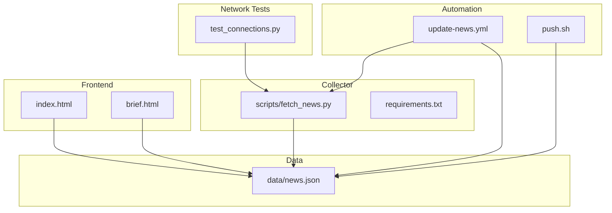
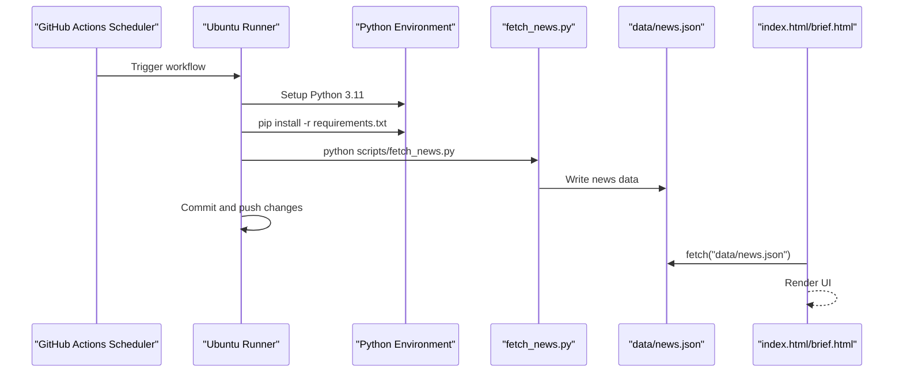
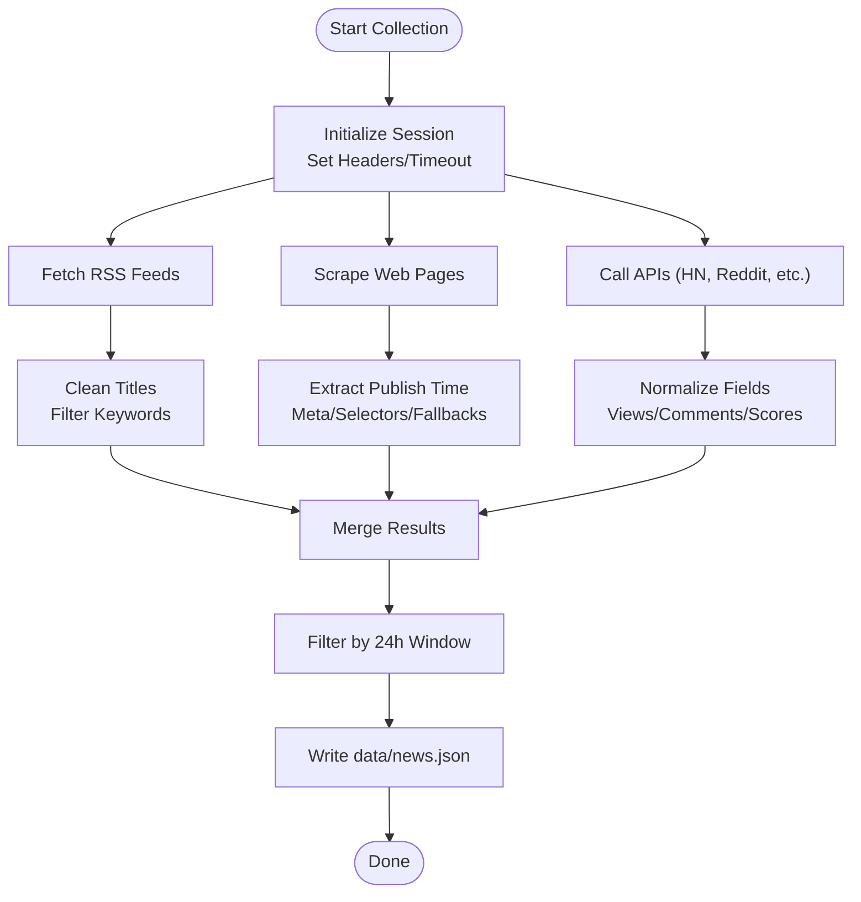
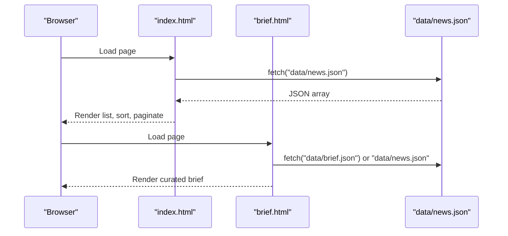
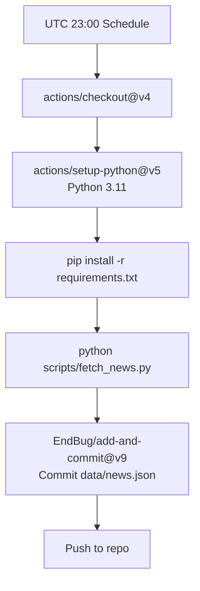
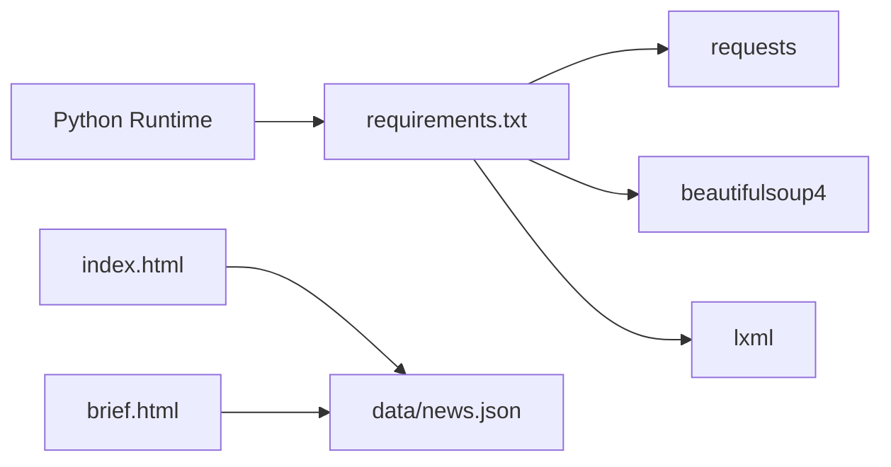

# Troubleshooting & FAQ

<cite>
**Referenced Files in This Document**
- [README.md](file://README.md)
- [fetch_news.py](file://scripts/fetch_news.py)
- [requirements.txt](file://requirements.txt)
- [test_connections.py](file://test_connections.py)
- [update-news.yml](file://.github/workflows/update-news.yml)
- [index.html](file://index.html)
- [brief.html](file://brief.html)
- [news.json](file://data/news.json)
- [push.sh](file://push.sh)
- [test.py](file://test.py)
</cite>

## Table of Contents
1. [Introduction](#introduction)
2. [Project Structure](#project-structure)
3. [Core Components](#core-components)
4. [Architecture Overview](#architecture-overview)
5. [Detailed Component Analysis](#detailed-component-analysis)
6. [Dependency Analysis](#dependency-analysis)
7. [Performance Considerations](#performance-considerations)
8. [Troubleshooting Guide](#troubleshooting-guide)
9. [Conclusion](#conclusion)
10. [Appendices](#appendices)

## Introduction
This Troubleshooting & FAQ guide focuses on diagnosing and resolving common issues in the Daily News system. It covers news source unavailability, API rate limits, network connectivity issues, data processing errors, GitHub Actions workflow failures, deployment issues, frontend display problems, Python dependency conflicts, environment configuration errors, performance optimization, and debugging strategies for collection and validation failures. It also includes frequently asked questions about system requirements, supported browsers, mobile compatibility, and maintenance procedures.

## Project Structure
The Daily News system consists of:
- A Python news collector that scrapes RSS feeds, web pages, and APIs, then writes structured JSON data.
- A static HTML/JavaScript frontend that renders the news list and a specialized AI-focused brief page.
- A GitHub Actions workflow that automates daily updates.
- Supporting scripts for testing connectivity and pushing changes.

**Diagram sources**
- [fetch_news.py:12-32](file://scripts/fetch_news.py#L12-L32)
- [requirements.txt:1-4](file://requirements.txt#L1-L4)
- [news.json:1-10](file://data/news.json#L1-L10)
- [index.html:282-295](file://index.html#L282-L295)
- [brief.html:381-408](file://brief.html#L381-L408)
- [update-news.yml:1-38](file://.github/workflows/update-news.yml#L1-L38)
- [push.sh:1-60](file://push.sh#L1-L60)
- [test_connections.py:1-45](file://test_connections.py#L1-L45)

**Section sources**
- [README.md:1-153](file://README.md#L1-L153)
- [fetch_news.py:12-32](file://scripts/fetch_news.py#L12-L32)
- [requirements.txt:1-4](file://requirements.txt#L1-L4)
- [news.json:1-10](file://data/news.json#L1-L10)
- [index.html:282-295](file://index.html#L282-L295)
- [brief.html:381-408](file://brief.html#L381-L408)
- [update-news.yml:1-38](file://.github/workflows/update-news.yml#L1-L38)
- [push.sh:1-60](file://push.sh#L1-L60)
- [test_connections.py:1-45](file://test_connections.py#L1-L45)

## Core Components
- News Collector (Python): Implements retry logic, RSS and web scraping, time extraction, filtering, and writes news data to JSON.
- Frontend (index.html): Loads news.json, sorts and displays entries, supports top/bottom views, and toggles details.
- Brief Page (brief.html): Renders a curated summary and insights derived from news data.
- GitHub Actions Workflow: Automates installation of dependencies, running the collector, and committing updates.
- Connectivity Tester: Validates external site accessibility with configured headers.
- Push Script: Handles local commits, rebasing, conflict resolution, and pushing to remote.

**Section sources**
- [fetch_news.py:69-83](file://scripts/fetch_news.py#L69-L83)
- [fetch_news.py:87-152](file://scripts/fetch_news.py#L87-L152)
- [fetch_news.py:193-220](file://scripts/fetch_news.py#L193-L220)
- [index.html:282-295](file://index.html#L282-L295)
- [brief.html:381-408](file://brief.html#L381-L408)
- [update-news.yml:23-37](file://.github/workflows/update-news.yml#L23-L37)
- [test_connections.py:36-44](file://test_connections.py#L36-L44)
- [push.sh:23-57](file://push.sh#L23-L57)

## Architecture Overview
The system follows a pipeline: collector gathers data, persists JSON, and the frontend reads JSON to render the UI. Automation runs the collector periodically and pushes updates.

**Diagram sources**
- [update-news.yml:3-37](file://.github/workflows/update-news.yml#L3-L37)
- [fetch_news.py:12-32](file://scripts/fetch_news.py#L12-L32)
- [news.json:1-10](file://data/news.json#L1-L10)
- [index.html:282-295](file://index.html#L282-L295)
- [brief.html:381-408](file://brief.html#L381-L408)

## Detailed Component Analysis

### News Collection Pipeline
- Retry and timeout logic reduce transient failures.
- RSS parsing extracts titles, links, dates, and cleans titles.
- Web scraping extracts publication times via meta tags and selectors, with fallbacks.
- Filtering ensures titles meet length and keyword criteria.
- Hacker News, Reddit, and other sources are integrated with API calls and rate-aware delays.

**Diagram sources**
- [fetch_news.py:69-83](file://scripts/fetch_news.py#L69-L83)
- [fetch_news.py:87-152](file://scripts/fetch_news.py#L87-L152)
- [fetch_news.py:193-220](file://scripts/fetch_news.py#L193-L220)
- [fetch_news.py:1761-1807](file://scripts/fetch_news.py#L1761-L1807)
- [fetch_news.py:1809-1847](file://scripts/fetch_news.py#L1809-L1847)
- [news.json:1-10](file://data/news.json#L1-L10)

**Section sources**
- [fetch_news.py:69-83](file://scripts/fetch_news.py#L69-L83)
- [fetch_news.py:87-152](file://scripts/fetch_news.py#L87-L152)
- [fetch_news.py:193-220](file://scripts/fetch_news.py#L193-L220)
- [fetch_news.py:1761-1807](file://scripts/fetch_news.py#L1761-L1807)
- [fetch_news.py:1809-1847](file://scripts/fetch_news.py#L1809-L1847)
- [news.json:1-10](file://data/news.json#L1-L10)

### Frontend Rendering and Display
- index.html fetches news.json and renders a sortable, paginated list with top/bottom views.
- brief.html loads either AI-generated brief.json or falls back to news.json to generate a curated report.

**Diagram sources**
- [index.html:282-295](file://index.html#L282-L295)
- [brief.html:381-408](file://brief.html#L381-L408)
- [news.json:1-10](file://data/news.json#L1-L10)

**Section sources**
- [index.html:282-295](file://index.html#L282-L295)
- [brief.html:381-408](file://brief.html#L381-L408)
- [news.json:1-10](file://data/news.json#L1-L10)

### GitHub Actions Workflow
- Scheduled daily at UTC 23:00 (Beijing 07:00).
- Installs dependencies, runs the collector, and commits/pushes changes.

**Diagram sources**
- [update-news.yml:3-37](file://.github/workflows/update-news.yml#L3-L37)

**Section sources**
- [update-news.yml:3-37](file://.github/workflows/update-news.yml#L3-L37)

## Dependency Analysis
- Python runtime and libraries are declared in requirements.txt.
- The collector depends on requests, beautifulsoup4, and lxml.
- The frontend relies on browser-native fetch to load JSON.

**Diagram sources**
- [requirements.txt:1-4](file://requirements.txt#L1-L4)
- [fetch_news.py:3-10](file://scripts/fetch_news.py#L3-L10)
- [index.html:282-295](file://index.html#L282-L295)
- [brief.html:381-408](file://brief.html#L381-L408)

**Section sources**
- [requirements.txt:1-4](file://requirements.txt#L1-L4)
- [fetch_news.py:3-10](file://scripts/fetch_news.py#L3-L10)
- [index.html:282-295](file://index.html#L282-L295)
- [brief.html:381-408](file://brief.html#L381-L408)

## Performance Considerations
- Network timeouts and retries: adjust timeout and max_retries in the collector to balance reliability and latency.
- Selector specificity: refine CSS selectors to reduce DOM parsing overhead during scraping.
- Data volume: limit fetched items per source (e.g., RSS items, web links) to control JSON size.
- Sorting and pagination: keep top/bottom views capped (default 20) to minimize rendering cost.
- CDN/static hosting: host data/news.json on a static provider to reduce server load.

[No sources needed since this section provides general guidance]

## Troubleshooting Guide

### News Source Unavailability
Symptoms:
- Empty or partial news lists.
- Errors indicating failed fetches for specific sources.

Diagnosis steps:
- Verify external site accessibility using the connectivity tester script.
- Check RSS URLs and web selectors for changes.
- Review logs from the collector for failed attempts and exceptions.

Resolution:
- Update RSS URLs or selectors in the collector.
- Add or improve time extraction strategies for problematic sites.
- Increase retry count or backoff timing if sources throttle.

**Section sources**
- [test_connections.py:36-44](file://test_connections.py#L36-L44)
- [fetch_news.py:87-152](file://scripts/fetch_news.py#L87-L152)
- [fetch_news.py:193-220](file://scripts/fetch_news.py#L193-L220)

### API Rate Limits
Symptoms:
- HTTP 429 or 403 responses from APIs.
- Partial data or empty results from Reddit/Hacker News.

Diagnosis steps:
- Inspect collector logs for HTTP errors.
- Confirm rate-limiting behavior by testing endpoints manually.

Resolution:
- Introduce delays between requests (already includes small sleeps).
- Use official SDKs or APIs with built-in retry/backoff.
- Consider caching recent results to reduce repeated calls.

**Section sources**
- [fetch_news.py:1761-1807](file://scripts/fetch_news.py#L1761-L1807)
- [fetch_news.py:1809-1847](file://scripts/fetch_news.py#L1809-L1847)

### Network Connectivity Issues
Symptoms:
- Frontend fails to load news.json.
- Collector cannot reach external sites.

Diagnosis steps:
- Run the connectivity tester to validate outbound access.
- Check firewall/proxy settings and DNS resolution.
- Verify HTTPS certificates and User-Agent headers.

Resolution:
- Adjust headers and timeouts in the collector.
- Configure proxy if behind corporate firewall.
- Use resilient DNS or mirror endpoints.

**Section sources**
- [test_connections.py:36-44](file://test_connections.py#L36-L44)
- [fetch_news.py:18-24](file://scripts/fetch_news.py#L18-L24)

### Data Processing Errors
Symptoms:
- Invalid JSON, missing fields, or malformed dates.

Diagnosis steps:
- Validate news.json structure and timestamps.
- Check title cleaning and filtering logic.
- Inspect time extraction logic for edge cases.

Resolution:
- Normalize date formats to ISO before writing.
- Add defensive checks for missing fields.
- Log and skip malformed entries instead of failing hard.

**Section sources**
- [news.json:1-10](file://data/news.json#L1-L10)
- [fetch_news.py:127-147](file://scripts/fetch_news.py#L127-L147)
- [fetch_news.py:1374-1621](file://scripts/fetch_news.py#L1374-L1621)

### GitHub Actions Workflow Failures
Symptoms:
- Workflow fails to install dependencies or run the collector.
- No updates committed/pushed.

Diagnosis steps:
- Review workflow logs for dependency or permission errors.
- Confirm Python version and pip cache.
- Validate that data/news.json is being written and staged.

Resolution:
- Align Python version with setup action.
- Upgrade pip before installing requirements.
- Ensure commit author/email is configured in CI.

**Section sources**
- [update-news.yml:18-37](file://.github/workflows/update-news.yml#L18-L37)

### Deployment Issues (push.sh)
Symptoms:
- Conflicts during git pull/rebase.
- Local vs remote data divergence.

Diagnosis steps:
- Examine merge/rebase conflicts for data/news.json.
- Confirm ownership of conflicting files.

Resolution:
- Use the script’s conflict resolution for data/news.json.
- Re-run the script after manual conflict resolution.

**Section sources**
- [push.sh:23-57](file://push.sh#L23-L57)

### Frontend Display Problems
Symptoms:
- Blank page or “no data” message.
- Sorting or pagination not working.

Diagnosis steps:
- Open browser dev tools and check network tab for news.json fetch.
- Verify JSON validity and required fields.
- Test JavaScript console for errors.

Resolution:
- Fix JSON schema mismatches.
- Ensure CORS headers if serving from different origin.
- Validate HTML/CSS responsiveness for mobile.

**Section sources**
- [index.html:282-295](file://index.html#L282-L295)
- [brief.html:381-408](file://brief.html#L381-L408)
- [news.json:1-10](file://data/news.json#L1-L10)

### Python Dependency Conflicts
Symptoms:
- Module import errors or incompatible versions.
- Pip install failures.

Diagnosis steps:
- Compare installed packages with requirements.txt.
- Check for conflicting virtual environments.

Resolution:
- Use a dedicated virtual environment.
- Pin compatible versions in requirements.txt.
- Reinstall dependencies with --force-reinstall.

**Section sources**
- [requirements.txt:1-4](file://requirements.txt#L1-L4)
- [update-news.yml:23-26](file://.github/workflows/update-news.yml#L23-L26)

### Environment Configuration Errors
Symptoms:
- Collector runs locally but fails in CI.
- Missing secrets or credentials.

Resolution:
- Match Python version and environment between local and CI.
- Provide required environment variables if any.
- Use isolated dependency installation in CI.

**Section sources**
- [update-news.yml:18-26](file://.github/workflows/update-news.yml#L18-L26)

### Performance Optimization
Recommendations:
- Limit concurrent requests and add jitter.
- Cache frequently accessed resources.
- Minimize DOM parsing by refining selectors.
- Precompute hotness scores server-side if needed.

**Section sources**
- [fetch_news.py:69-83](file://scripts/fetch_news.py#L69-L83)
- [index.html:297-305](file://index.html#L297-L305)

### Debugging Strategies
- Enable verbose logging in the collector for failed sources.
- Validate RSS feeds and web pages with offline parsers.
- Use browser dev tools to inspect network and console logs.
- Add unit tests for time extraction and filtering logic.

**Section sources**
- [fetch_news.py:1374-1621](file://scripts/fetch_news.py#L1374-L1621)
- [index.html:282-295](file://index.html#L282-L295)
- [brief.html:381-408](file://brief.html#L381-L408)

### Frequently Asked Questions

Q: What are the system requirements?
- Python 3.11 recommended.
- Standard desktop/laptop with internet access.

Q: Which browsers are supported?
- Modern browsers (Chrome, Firefox, Safari, Edge) on desktop and mobile.

Q: Is the system mobile-friendly?
- Yes, responsive CSS is included.

Q: How often does the system update?
- Daily at UTC 23:00 (Beijing 07:00).

Q: How do I add a new news source?
- Extend the collector with a new fetch_* method and update data persistence.

Q: How do I troubleshoot missing modules?
- Reinstall dependencies from requirements.txt in a fresh environment.

Q: How do I resolve data conflicts during push?
- Use the provided push script to auto-resolve data/news.json conflicts.

Q: How do I test external site availability?
- Run the connectivity tester script to validate access.

Q: How do I run the collector locally?
- Install dependencies and run the collector script.

Q: How do I preview the brief page?
- Open brief.html in a browser; it will load AI brief or fall back to news data.

**Section sources**
- [update-news.yml:3-6](file://.github/workflows/update-news.yml#L3-L6)
- [index.html:282-295](file://index.html#L282-L295)
- [brief.html:381-408](file://brief.html#L381-L408)
- [test_connections.py:36-44](file://test_connections.py#L36-L44)
- [requirements.txt:1-4](file://requirements.txt#L1-L4)
- [push.sh:23-57](file://push.sh#L23-L57)
- [README.md:13-28](file://README.md#L13-L28)

## Conclusion
This guide provides practical diagnostics and resolutions for the most common Daily News system issues. By following the outlined procedures—validating connectivity, adjusting timeouts, refining selectors, and leveraging automation—you can maintain a reliable, high-performance news aggregation pipeline with a responsive frontend.

[No sources needed since this section summarizes without analyzing specific files]

## Appendices

### Quick Diagnostic Checklist
- Can the collector connect to external sites?
- Are dependencies installed correctly?
- Does news.json contain required fields?
- Are GitHub Actions logs clean?
- Does the browser load news.json successfully?

**Section sources**
- [test_connections.py:36-44](file://test_connections.py#L36-L44)
- [requirements.txt:1-4](file://requirements.txt#L1-L4)
- [news.json:1-10](file://data/news.json#L1-L10)
- [update-news.yml:23-37](file://.github/workflows/update-news.yml#L23-L37)
- [index.html:282-295](file://index.html#L282-L295)